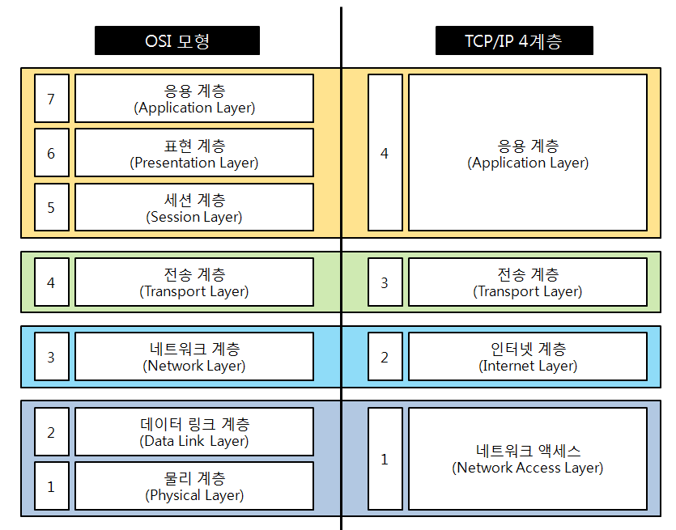
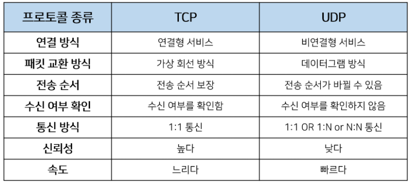
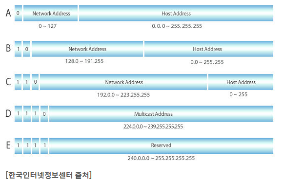
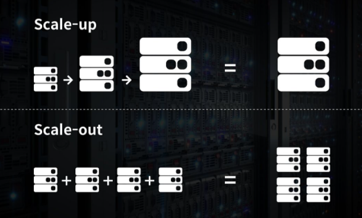
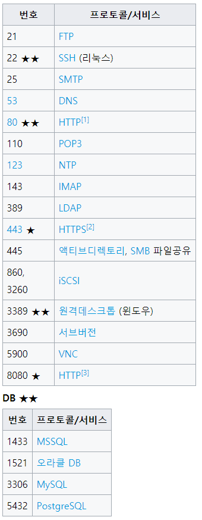

# 21.01.15 TCP & UDP

## 주요 질문

#### 💡 TCP/IP에 대해서 설명해주세요.
   * 인터넷에 연결된 서로 다른 기종의 컴퓨터들이 데이터를 주고받을 수 있도록 하는 표준 프로토콜입니다.

   * TCP프로토콜과 IP프로토콜이 결합된 것을 의미합니다.

   * TCP프로토콜은 전송계층으로 신뢰성 있는 연결형 서비스를 제공합니다.

   * IP프로토코콜은 네트워크 계층으로 데이터그램을 기반으로 하는 비 연결형 서비스를 제공합니다.
   

#### 💡 TCP/IP 프로토콜 4계층을 설명해주세요.
   * TCP/IP는  네트워크 액세스 계층, 인터넷 게층, 전송계층, 응용 계층으로 이루어져 있습니다.

   * __네트워크 액세스 계층__ 은 실제 데이터를 송수신하는 역할입니다.

   * __인터넷 계층__ 은 데이터 전송을 위한 주소지정, 경로설정을 제공합니다.

   * __전송 계층__ 은 호스트들 간의 신뢰성 있는 통신을 제공합니다.

   * __응용 계층__ 은 응용 프로그램 간의 데이터 송수신을 제공합니다.

       
  
   
#### 💡 TCP와 UCP의 특징과 차이점을 설명해주세요.
   * __TCP__ (Transmission Control Protocol)는 전송제어 프로토콜로 양방향 연결형 서비스를 제공합니다.
   가상회선 연결 형태의 서비스를 제공합니다.
   신뢰성있는 전송이 중요할 때 사용하는 프로토콜 입니다.
   * __UDP__ (User Datagram Protocol)는 비연결형 서비스를 제공합니다.
   데이터를 데이터그램 단위로 처리하는 프로토콜 입니다.
   신뢰성보다는 속도가 중요한 서비스에서 사용하는 프로토콜 입니다.
   스트리밍처럼 실시간 서비스에서 주로 사용됩니다.

      

#### 💡 3-Handshaking과 4-Handshaking의 과정을 설명해주세요.
   * 3way handshaking은 TCP의 연결을 설정하는 과정입니다.
예를 들어 클라이언트가 서버에게 연결을 요청한다고 가정하겠습니다.

      1. 클라이언트는 먼저 서버에게 연결 요청 세그먼트 SYN을 전송합니다.
      2. 서버는 클라이언트에게 요청을 수락했으며 클라이언트도 포트를 열어달라는 세그먼트 SYN과 ACK를 전송합니다.
      3. 마지막으로 클라이언트가 수락 세그먼트 ACK를 보내서 연결을 맷습니다.

   * 4way handshaking은 TCP의 연결을 해제하는 과정입니다.
예를 들어 클라이언트가 서버에게 연결 해제를 요청한다고 가정하겠습니다.

      1. 클라이언트는 서버에게 연결종료 세그먼트인 FIN세그먼트를 전송합니다.
      2. 서버는 일단 확인 세그먼트 ACK를 보내고 자신이 전송할 데이터가 남아있다면 계속 전송합니다.
      3. 서버는 클라이언트에게 통신이 끝났다는 의미로 FIN 세그먼트를 전송합니다.
      4. 클라이언트는 서버에게 확인했다는 세그먼트 ACK를 전송합니다.
   

#### 💡 로드 밸런싱을 설명해주세요.
   * 특정 서버에 집중되는 부하를 덜기 위해 여러 개의 서버로 분산시키는 네트워크 서비스입니다.
   Scale-out 방식으로 서버를 증설했을 때 여러 대의 서버로 트래픽을 균등하게 분산해주는 로드밸런싱이 필요합니다.
   로드 밸런싱 기법에는 여러가지가 있습니다.

      * __라운드로빈 방식(Round Robin Method)__

         서버에 들어온 요청을 순서대로 돌아가며 배정하는 방식입니다. 클라이언트의 요청을 순서대로 분배하기 때문에 여러 대의 서버가 동일한 스펙을 갖고 있고, 서버와의 연결(세션)이 오래 지속되지 않는 경우에 활용하기 적합합니다.

      * __IP 해시 방식(IP Hash Method)__

         클라이언트의 IP 주소를 특정 서버로 매핑하여 요청을 처리하는 방식입니다.사용자의 IP를 해싱해(Hashing,임의의 길이를 지닌 데이터를 고정된 길이의 데이터로 매핑하는 것,또는 그러한 함수)로드를 분배하기 때문에 사용자가 항상 동일한 서버로 연결되는 것을 보장합니다.

      *   __최소 연결 방식(Least Connection Method)__

          요청이 들어온 시점에 가장 적은 연결상태를 보이는 서버에 우선적으로 트래픽을 배분합니다. 자주 세션이 길어지거나, 서버에 분배된 트래픽들이 일정하지 않은 경우에 적합한 방식입니다.
   

#### 💡 IPV4  vs IPV6 을 설명해주세요.

   * IPv4는 32비트로 이루어져 2^32개의 주소를 부여할 수 있습니다.

   * IPv6 는 현재 사용하고 있는 주소 체계인 IPv4 의 주소 부족 문제를 해결하기 위해 개발되었습니다.
   128비트로 이루어져 2^128개의 주소를 부여할 수 있습니다.
   이를 통해 주소 부족 문제를 해결할 수 있습니다.

 

## 심화 질문

#### 💡 UDP에서 신뢰도, 순서를 보장방법을 설명해주세요.
   * RUDP(Reliable UDP)
      통신이 실패했을 때 Relay 서버를 통한 데이터 재전송이 일어남
      패킷의 지연은 있을 수 있으나 피킷의 소실은 발생하지 않음.
   
#### 💡 게이트웨이란?
   * OSI 전 계층(1~7계층) 의 프로토콜 구조가 다른 네트워크의 연결을 수행합니다.
      세션 계층, 표현 계층, 응용 계층 간을 연결하여 데이터 형식 변환, 주소 변환, 프로토콜 변환 등을 수행합니다.
      LAN에서 다른 네트워크에 데이터를 보내거나 다른 네트워크로부터 데이터를 받아들이는 출입구 역할을 합니다.
   
 #### 💡 IP 주소란?

   * Internet Protocol Address로 인터넷에 연결된 모든 컴퓨터 자원을 구분하기 위한 고유 주소입니다.

   * IP주소는 네트워크 부분의 길이에 따라 A클래스에서 E클래스까지 5단게로 구성되어 있습니다.

       

#### 💡 IP란?

   * 네트워크 계층의 프로토콜로 패킷의 분해, 조립, 주소지정, 경로 선택 기능을 제공합니다.

#### 💡 주요 포트 번호들을 설명해주세요.
   * SSH는 22번 포트를 사용합니다.
   * HTTP는 80번 포트를 사용합니다.
   * HTTPS는 443번 포트를 사용합니다.
   * 데이터베이스의 경우 MySQL은 3306번, PostgreSQL은 5432번 포트를 사용합니다.
   

#### 💡 IPv4의 주소 부족현상을 해결하기 위해 현재 어떤 방법을 사용하고 있나요?

* 네트워크 주소 변환(NAT)과 서브네팅을 사용합니다.

* NAT은 집이나 사무실의 모든 장치들에 IP주소를 할당하게 되면 필요량이 많아질 때 홈 네트워크에 속한 장치들을 모두 같은 네트워크 주소로 묶어주는 방식입니다.

* 서브네팅은 네트워크를 쪼개서 IP를 분할하는 방식입니다.

#### 💡 클라이언트가 서버가 보낸 ACK+SYN을 받지 못하면?

* 클라이언트는 서버에게 SYN 세그먼트를 보내고 시간을 잽니다.

* Timeout이 되기 전까지 서버에게 ACK, SYN 세그먼트가 오지 않으면 클라이언트는 다시 SYN 세그먼트를 보내고 수신을 대기합니다.

#### 💡 4-way handshaking 과정에서 서버가 마지막에 FIN을 보내는 이유?

* 서버가 아직 클라이언트에게 보낼 데이터가 남아있을 경우 데이터를 다 전송하지 못한 채 클라이언트에서 포트를 닫을 수 있습니다. 

* 그래서 서버 또한 종료될 준비가 되었다는 의미로 FIN 세그먼트를 보냅니다.

#### 💡 4-way handshaking 과정에서 클라이언트가 마지막에 ACK를 굳이 보내는 이유?

* 서버가 보낸 FIN 세그먼트를 클라이언트가 받지 못하면 클라이언트는 FIN_WAIT_2상태로 종료되지 못한 채 계속 기다려야 합니다. 하지만 서버는 이미 포트를 닫고 응답하지 않은 상태이기 때문에 클라이언트는 불필요햔 자원을 소모할 수 있습니다.

#### 💡 만약 Server에서 FIN 세그먼트를 전송하기 전에 전송한 패킷이 Routing 지연이나 패킷 유실로 인한 재전송 등으로 인해 FIN 패킷보다 늦게 도착하는 상황이 발생하면 어떻게 될까?

* Client에서 세션을 종료시킨 후 뒤늦게 도착하는 패킷이 있다면 이 패킷은 Drop되고 데이터는 유실될 것입니다.

* 이러한 현상에 대비하여 Client는 Server로부터 FIN을 수신하더라도 일정시간(디폴트 240초)동안 세션을 남겨놓고 잉여 패킷을 기다리는 과정을 "TIME_WAIT"라고 합니다.

 

    
출처

         https://redbinalgorithm.tistory.com/436
  

#### 💡 초기 Sequence Number인 ISN을 0부터 시작하지 않고 난수를 생성해서 설정하는 이유?(잘 모르겠음)

* 서버 측에서는 패킷의 SYN을 보고 패킷을 구분하게 되는데 난수가 아닌 순차적인 number가 전송된다면 이전의 connection으로부터 오는 패킷으로 인식할 수 있습니다. 
이러한 문제가 발생할 가능성을 줄이기 위해서 난수로 ISN을 설정합니다.

 

## 개념 정리

#### ⭐ Scale-up vs Scale-out
   *  Scale-up: 서버 자체의 성능 확장
    - CPU i3→i7
   * Scale-out: 서버 개수를 늘리는 것
 

   

   

    
출처

      * https://m.post.naver.com/viewer/postView.nhn?volumeNo=27046347&memberNo=2521903
  

#### ⭐ 주요 포트 번호
   

 

    
TCP, UDP 추가 설명

      * https://www.notion.so/NETWORK-TCP-UDP-3a015a22840d4fb0b2dd4eefb5e3b199
  

 
