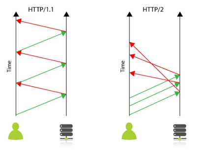

# 21.01.16 HTTP & HTTPS

## 주요 질문

#### 💡 HTTP 프로토콜을 설명해주세요.

* Hyper Text Transfer Protocol의 약자로 인터넷에서 데이터를 주고 받을 수 있는 프로토콜입니다. 

#### 💡 HTTPS 프로토콜을 설명해주세요.

* HTTPS는 HTTP에 S(Secure Socker)을 추가한 것입니다. 데이터를 주고받는 과정에 보안 요소가 추가됩니다. 

* 클라이언트는 공개키로 데이터를 암호화해서 전송하고 서버는 개인키를 이용해 복호화 합니다.

* 서버는 개인키로 데이터를 암호화해서 전송하고 공개키가 있는 클라이언트에서 데이터를 복호화 합니다.

#### 💡 HTTP의 단점을 설명해주세요.

* 암호화되지 않은 통신이기 때문에 도청과 변조가 가능합니다.

#### 💡  HTTP REQUEST 방식 중 GET과 POST의 차이을 설명해주세요.

* GET방식은 정보를 가져와서 조회하기 위한 방식입니다.
url에 데이터를 포함시켜서 서버에 요청하기 때문에 보안에 취약합니다.
주로 즐겨찾기를 편리하게 하기 위해 사용합니다.

* POST방식은 데이터를 서버로 보내서 추가하기 위한 방식입니다.
서버로 전달하고자 하는 데이터를 body에 넣어서 전달을 합니다. get방식에 비해 url에 데이터를 노출시키지 않아 보안에 좋습니다.
POST방식은 DB의 내용을 갱신해야하거나 서버로 데이터를 전달해야할 때 쓰는 것이 적합합니다.

#### 💡  GET, POST를 제외하고 다른 방식들을 설명해주세요.

* Put은 데이터를 추가하거나 수정할 때 사용합니다.

* Patch는 데이터 일부분을 수정할 때 사용합니다.

* Delete는 정보를 삭제할 때 사용합니다.
   
   
#### 💡 HTTP1 vs HTTP2 를 설명해주세요.

* HTTP1은 연결당 하나의 요청과 응답을 처리합니다. 동시전송 문제와 다수의 리소스를 처리하기에 속도와 성능문제가 발생할 수 있습니다.

* HTTP2는 한 커넥션에 여러개의 메시지를 동시에 주고받을 수 있습니다. 문서상 필요한 리소스를 클라이언트의 요청 없이 보내줄 수도 있고, 헤더 정보를 압축하는 것도 가능합니다.
그래서 성능과 속도 면에서 HTTP1보다 뛰어납니다.

   

 

## 심화 질문

#### 💡 HTTP는 비연결성 프로토콜이냐? 연결성 프로토콜이냐?

* 비연결성 프로토콜입니다. 클라이언트 요청에 대해 서버가 응답을 마치면 맺었던 연결을 끊습니다.

#### 💡 왜 비연결성인가?

* HTTP는 인터넷 상에서 불특정 다수의 통신 환경을 기반으로 설계되었습니다.
만약 서버에서 다수의 클라이언트와 연결을 계속 유지해야 한다면, 이에 따른 많은 리소스가 발생하게 됩니다.
따라서 **연결을 유지하기 위한 리소스를 줄이면 더 많은 연결을 할 수 있으므로** 비연결적인 특징을 갖습니다.

* 단점으로는 서버는 클라이언트를 기억하고 있지 않으므로 동일한 클라이언트의 모든 요청에 대해, 매번 새로운 연결을 시도/해제의 과정을 거쳐야하므로 연결/해제에 대한 오버헤드가 발생한다는 점이 있습니다.

#### 💡 현대 웹 에서는 비연결성을 해결방법을 설명해주세요.
* 전통적으로 Cookie와 Session을 많이 이용합니다. 

* Cookie에 클라이언트에 대한 정보를 저장해뒀다가 사용하거나 Session을 등록해서 유지하는 방식으로 많이 사용합니다. 

* HTML5에서 제공하는 Session Storage나 Local Storage도 사용할 수 있습니다. 
세션 스토리지는 세션이 유지되고 있을 때 까지는 브라우저 내부 스토리지에 저장을 하고 세션이 끊키면 자동으로 없어집니다. 
로컬 스토리지 같은 경우는 내부적으로 삭제를 하지 않는 이상 영구적으로 저장됩니다.
   

#### 💡 세션과 쿠키를 사용하는 이유를 설명해주세요.

* 웹사이트에서 방문자가 머무르는 동안 방문자의 상태를 유지하기 위해 사용합니다.

#### 💡 보안성 낮은 쿠키를 쓰는 이유를 설명해주세요.

* 세션을 과도하게 생성하면 서버의 메모리가 과도하게 사용되어 무리가 가기 때문입니다.

#### 💡 세션과 쿠키의 차이점을 설명해주세요.

#### 💡 Session 동작 순서를 설명해주세요.

1. 웹사이트에 접속합니다.
2. 서버는 세션 ID를 하나 생성해서 쿠키 값으로 만들고 웹 브라우저에 전송합니다.
3. 웹 브라우저는 이 쿠키값을 저장해 두었다가 웹 서버에 무언가 요청할 때마다 쿠키 헤더를 통해서 세션을 보냅니다.
4. 서버는 요청을 받을 때마다 세션 ID를 확인하고 정보가 알맞을 때에만 사용자에게 데이터를 보내줍니다.

#### 💡  Cookie, Session, Session Storage, Local Storage 중 어떤 것이 가장 효율적인가요?

 

## 개념 정리

### ⭐쿠기

* 사용자정보를 클라이언트 로컬에 저장하는 것입니다.
브라우저를 종료해도 사용자의 하드 드라이브에 저장돼서 사라지지 않습니다.
직접 삭제하거나 만료되어야 합니다.

* 보안성이 낮습니다.

* 자동 로그인, 장바구니에 사용됩니다.
   

 

#### ⭐ 세션
   * 세션은 방문자가 웹에 접속하는 시점에 생기고 웹에 종료하는 시점에 삭제됩니다.
세션 아이디는 쿠키로 전달됩니다.

 
