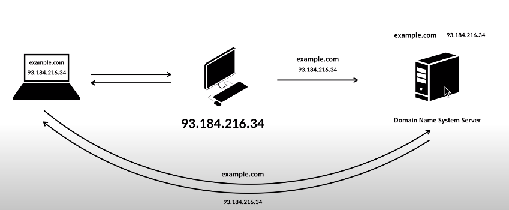
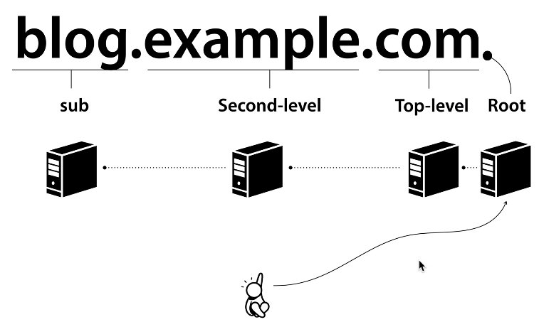

# 21.01.16 DNS

## 주요 질문

#### 💡 DNS란?
   

* Doman  Name System의 약자로 도메인 네임을 IP주소로 매핑하는 시스템입니다.
* client 컴퓨터가 도메인 이름의 ip주소를 물어보면 알려주고, 서버 컴퓨터는 자신의 이름과 IP주소를 DNS서버에 저장합니다.

#### 💡 Domain Name 구조를 설명해주세요.
   

* Root DNS server는 Top level의 주소 목록을 알고 있습니다.

* Top level 서버는 Second level의 주소 목록을 알고 있습니다.

* Second level 서버는 sub의 주소 목록을 알고 있습니다.

* 모든 dns서버는 루트의 주소를 알고 있고, sub 서버가 Doman Name의 최종 ip 주소를 알려줍니다.

#### 💡 Domain Name System 과정을 설명해주세요.

1. 처음에 사용자가 root 서버에게 주소를 물어봅니다. 
root서버는 "com"의 top level 서버 주소를 알려줍니다.

2. 사용자는 top level 서버에게 주소를 물어봅니다.
top level 서버는 "example.com"의 second level 서버 주소를 알려줍니다.

3. 사용자는 second level 서버에게 주소를 물어봅니다.
second level 서버는 "blog.example.com"의 sub 서버 주소를 알려줍니다.

4. 사용자는 sub 서버에게 주소를 물어봅니다.
sub 서버는 사용자에게 최종적으로 "blog.example.com"의 ip주소를 알려줍니다.
   

   

    
출처

    https://www.youtube.com/watch?v=2EIgPYRzVwY&feature=emb_logo
  

 

## 심화 질문

 #### 💡
   
 

## 개념 정리

#### ⭐ DNS 서비스 유형

[https://ijbgo.tistory.com/27](https://ijbgo.tistory.com/27)

이해 안감

#### ⭐ DNS round robin 방식(모르겠어)
* DNS Round Robin 방식의 문제점
서버의 수 만큼 공인 IP 주소가 필요함. 부하 분산을 위해 서버의 대수를 늘리기 위해서는 그 만큼의 공인 IP 가 필요하다.

* 균등하게 분산되지 않음 모바일 사이트 등에서 문제가 될 수 있는데, 스마트폰의 접속은 캐리어 게이트웨이 라고 하는 프록시 서버를 경유 한다. 프록시 서버에서는 이름변환 결과가 일정 시간 동안 캐싱되므로 같은 프록시 서버를 경유 하는 접속은 항상 같은 서버로 접속된다. 또한 PC 용 웹 브라우저도 DNS 질의 결과를 캐싱하기 때문에 균등하게 부하분산 되지 않는다. DNS 레코드의 TTL 값을 짧게 설정함으로써 어느 정도 해소가 되지만, TTL 에 따라 캐시를 해제하는 것은 아니므로 반드시 주의가 필요하다.

* 서버가 다운되도 확인 불가 DNS 서버는 웹 서버의 부하나 접속 수 등의 상황에 따라 질의결과를 제어할 수 없다. 웹 서버의 부하가 높아서 응답이 느려지거나 접속수가 꽉 차서 접속을 처리할 수 없는 상황인 지를 전혀 감지할 수가 없기 때문에 어떤 원인으로 다운되더라도 이를 검출하지 못하고 유저들에게 제공한다. 이때문에 유저들은 간혹 다운된 서버로 연결이 되기도 한다. DNS 라운드 로빈은 어디까지나 부하분산 을 위한 방법이지 다중화 방법은 아니므로 다른 S/W 와 조합해서 관리할 필요가 있다.

* Round Robin 방식을 기반으로 단점을 해소하는 DNS 스케줄링 알고리즘이 존재한다. (일부만 소개)
   * Weighted round robin (WRR)
각각의 웹 서버에 가중치를 가미해서 분산 비율을 변경한다. 물론 가중치가 큰 서버일수록 빈번하게 선택되므로 처리능력이 높은 서버는 가중치를 높게 설정하는 것이 좋다.

   * Least connection
접속 클라이언트 수가 가장 적은 서버를 선택한다. 로드밸런서에서 실시간으로 connection 수를 관리하거나 각 서버에서 주기적으로 알려주는 것이 필요하다.

 
