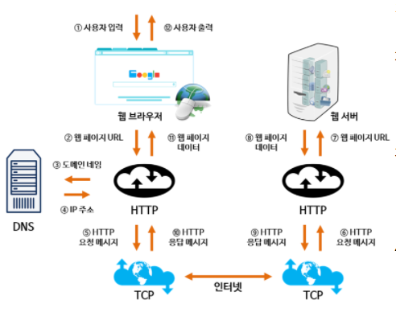
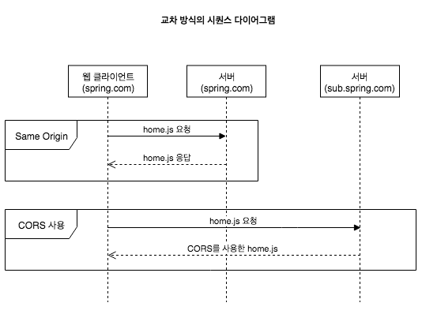
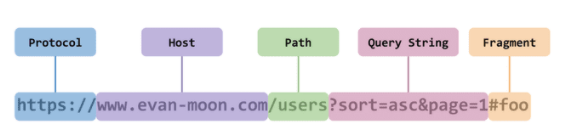
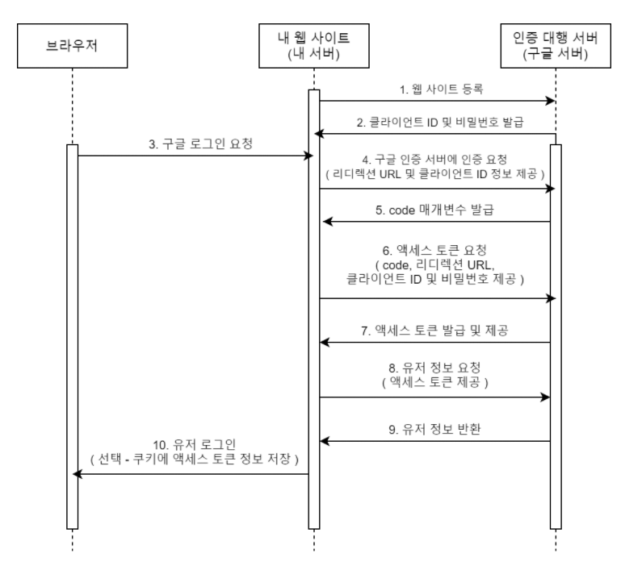

# 21.01.19 CORS, OAuth2, Socket, 웹 통신, Rest, Restful

## 주요 질문

#### 💡 브라우저에 "www.google.com" 입력하면 어떤일이 일어날까요?

  *  <백엔드>
      1. DNS에서 IP주소를 가져옵니다.
      2. Server의 IP주소로 HTTP요청 메시지를 생성합니다.
      3. TCP 프로토콜을 사용해서 해당 IP주소로 요청 메시지를 전송합니다.
      3. HTTP프로토콜을 사용해서 웹 페이지 URL정보로 변환되어 해당하는 데이터를 검색합니다. 이를 HTTP 응답 메시지로 변환합니다.
      4. TCP프로토콜을 사용해서 원래 컴퓨터로 전송됩니다.
      5. 도착한 응답메시지는 HTTP프로토콜을 통해 웹 페이지 데이터로 변환되어 웹 브라우저에 보이게 됩니다.

         

   * <클라이언트>
      1. 주소창에 url을 입력하고 enter를 누르면 서버에 요청이 전송됩니다.
      2. 해당 페이지에 존재하는 여러 자원들인 html, image 파일들이 보내집니다.
      3. 브라우저에서 렌더링 엔진이 해당 자원이 담긴 html과 스타일이 담긴 css 파일을 해석합니다.
      4. 렌더링 엔진은 HTML 파싱과정을 통해 DOM트리를 구축합니다.
      5. CSS파싱과 DOM트리를 이용해 렌더 트리를 만듭니다.
      6. DOM트리는 웹상의 내용을 담고 있고 렌더 트리는 시각적 스타일 정보를 담고 있습니다.
      7. UI백엔드가 동작하여 노드들을 정해진 스타일과 위치대로 화면에 배치합니다.
      8. 이때 빠르게 브라우저에 화면을 표시하기 위해 자원을 전송받은 순서대로 화면에 표시합니다.(자원이 모두 전송되기를 기다리지 않습니다.) 

 

    
출처

    * https://github.com/JaeYeopHan/Interview_Question_for_Beginner/tree/master/Network#dns-round-robin-방식  
   * https://bohyeon-n.github.io/deploy/network/internet-2.html  
   * https://sophia2730.tistory.com/entry/DNS-%EC%A3%BC%EC%86%8C%EC%B0%BD%EC%97%90-wwwnavercom%EC%9D%84-%EC%B9%98%EB%A9%B4-%EC%9D%BC%EC%96%B4%EB%82%98%EB%8A%94-%EC%9D%BC
  

  
   
#### 💡 RESTful 이란 무엇인가요?
   * Rest를 Rest답게 쓰기 위한 방법입니다.
   * Restful의 목적은 이해하기 쉽고 사용하기 쉬운 REST API를 만드는 것입니다.
   * Rest란 네트워크 상에서 Client와 Server 가 통신하는 방식입니다.
   HTTP URI를 통해 자원을 명시하고, HTTP method(Post, Put, Get, Delete)를 통해 해당 자원에 대한 CRUD를 적용하는 것을 의미합니다.
   

 

## ⭐ 개념 정리

### CORS

   * Cross Origin Resource Sharing의 약자로 서로 다른 Origin끼리 자원을 공유할 수 있는 방식입니다.
   * HTTP 헤더를 사용해서 한 origin에서 실행중인 웹앱이 다른 origin의 자원에 접근할 수 있는 권한을 부여할 수 있는 체제입니다.
      * 서로 다른 Origin이란? Protocol, Host, Port 중 하나라도 다른 것을 의미합니다. 
         
   

    
출처

* https://velog.io/@sj950902/CORS%EC%99%80-SOP%EC%97%90-%EB%8C%80%ED%95%B4-%EC%95%8C%EC%95%84%EB%B3%B4%EC%9E%90-1%ED%83%84 

* [https://github.com/cheese10yun/TIL/blob/master/network/http/CORS.md](https://github.com/cheese10yun/TIL/blob/master/network/http/CORS.md)
  

 

### REST
   * Rest 제약조건
      - 클라이언트, 서버의 명확한 분리
      - 서버에 클라이언트 정보를 저장하지 않음
      - 클라이언트의 응답을 캐싱하는 기능
      - 서버는 확장성 있는 시스템 구성
      - 인터페이스 활용→ 구조를 분리해서 독립적으로 만듦
   * Rest 구성요소
      1. 자원(Resource): URI
      2. 행위(Verb): HTTP Method
         - **GET, POST, PUT, DELETE, HEAD** 와 같은 메서드
      3. 표현(Representation of Resource)
         - JSON 혹은 XML를 통해 데이터를 주고 받는 형식
   * Rest API
      - Rest 기반으로 서비스 API를 구현한 것
   * Restful하지 못한 경우
      - Ex1) CRUD 기능을 모두 POST로만 처리하는 API
      - Ex2) route에 resource, id 외의 정보가 들어가는 경우(/students/updateName)

### OAuth2
   * 웹사이트 계정인증에 타 서비스의 계정을 사용하는 인증방식입니다.
   인증의 과정을 타 서비스에게 위임하는 방식입니다.

   * 타 서비스는 계정정보가 유효한지, 유효하다면 유저 정보중 일부(유저 이름, 프로필 이미지 등)을 인증을 요청하는 서비스에게 제공해줍니다.
   

    
출처

   * [https://github.com/cheese10yun/TIL/blob/master/network/http/OAuth2.md](https://github.com/cheese10yun/TIL/blob/master/network/http/OAuth2.md)

### Socket.io vs Web Socket --수정하기
   * WebSocket
      - 웹 페이지의 한계에서 벗어나 실시간으로 상호작용하는 웹 서비스를 만드는 표준 기술
      - HTTP Request를 이용해서 자유롭게 데이터를 주고받을 수 있습니다.
      - ex) Jetty, Node.js, Netty

   * Socket.io
      - 큰 개념으로 WebSocket, Ajax Long Polling 등 다양한 방법을 하나의 API로 추상화한 것입니다.
      - javascript를 이용해서 브라우저 종류에 상관없이 실시간 웹을 구현할 수 있도록 한 기술입니다.
      - ex) Node.js
 

    
더 자세한 설명

   * https://www.notion.so/NETWORK-CORS-OAuth2-Socket-Rest-Restful-b726cc56790c4d019bbc04672e9f062b

