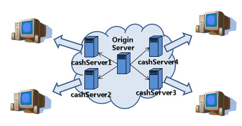

# 21.01.23 DOM, Blocking/NonBlocking, SPA, JWT/AJAX, CDN

## 주요 질문

#### 💡 DOM을 직접 접근할 때의 문제점

 * DOM은 기계나 소프트웨어가 웹 사이트의 구조를 어떻게 이해하는지에 대한 표준입니다.  DOM에 직접 접근하려면 DOM Tree의 최상단에 있는 document DOM을 통해 트리 밑으로 내려가야 합니다.  이러한 최상단 돔으로부터의 접근은 브라우저의 잦은 렌더링을 유발합니다.  그래서 효율성이 떨어진다는 단점이 있습니다.
  
   
#### 💡 가상 DOM 의미와 장점

 * 가상 돔은 별도 객체로 DOM을 생성하는 것입니다.  DOM에서 발생하는 여러 변경점들을 별도의 공간(버퍼)에 가상 DOM을 생성합니다. 그 뒤, 렌더링의 변경 시점이 생기면 변경점들을 일괄적으로 갱신하는 방법입니다.  이 방법은 브라우저의 렌더링 횟수를 줄여 성능 개선에 도움이 됩니다. 
 * SPA 프레임워크에서는 이러한 가상DOM 처리 작업을 프로그래머가 별도로 처리하지 않아도 자동으로 수행합니다.

## 심화 질문
#### 💡 기존 웹 환경에 비해 [SPA(Single Page Application)](#SPA)가 부각되는 이유

* 기존 웹은 화면을 이동할 때 필요한 HTML을 서버에서 받아 처음부터 다시 로딩합니다.  그래서 시간이 오래 걸립니다.  
* 반면, SPA에서는 화면 구성에 필요한 모든 HTML을 클라이언트가 갖고 있습니다.  서버에는 필요한 데이터를 요청하고 JSON으로 받기 때문에 기존의 웹에 비해 화면을 구성하는 속도가 빠릅니다.
* 단점으로는 처음 화면을 로딩할 때, 모든 화면이 미리 준비되어 있어야 한다는 점입니다.  그래서 로딩과 애플리케이션 구현에 시간이 오래 걸리고, 복잡합니다.

 

## ⭐ 개념 정리

### Blocking / NonBlocking
* Blocking
    * 프로세스는 시스템 호출 응답을 대기하는 상태로 기다립니다.  그 동안 다른 프로그렘 처리를 할 수 없습니다.

* NonBlocking
    * 시스템 호출 직후 호출 종료를 기다리지 않고 바로 다음 처리로 넘어갑니다.  CPU를 다른 프로세스에 사용함으로써 I/O 대기시간을 줄일 수 있습니다.

### SPA
* __Single Page Application__ 의 약자로 단일 페이지로 구성된 웹 어플리케이션을 말합니다.
* SPA는 컴포넌트들이 모여 한 페이지를 작성하고, 특정 부분만 데이터를 바인딩하는 개념입니다. 대표적인 SPA 라이브러리로 React.js, Vue.js, Angular2 등이 있습니다.

* 장점
    * 하나하나 화면 전체를 렌더링할 필요가 없기 때문에 화면이동이 빠르다.
    * 화면에 필요한 부분의 데이터만 받아서 렌더링 하기 때문에 처리과정이 효율적이다.

* 단점
    * 처음 화면을 로딩할 때, 모든 화면이 미리 준비되어 있어야 하기 때문에 로딩에 시간이 걸린다.
    * 어플리케이션을 구현하는데 보다 시간이 걸리며 복잡하다.

### JWT
* JWT는 __JSON Web Token__ 의 약자로 전자서명된, URL-safe한 Json 입니다.  URL-safe 하다는 것은 URL로 이용할 수 있는 문자로만 구성됐다는 의미입니다.
* 전자서명은 JSON의 변조를 체크할 수 있습니다.
* 클라이언트와 서버는 HTTP 리퀘스트 헤더에 JSON토큰을 넣습니다. 서버는 별도의 인증과정 없이 헤더의 JWT정보를 통해 인증합니다.

### AJAX
* Ajax는 __Asynchronous Javascript And Xml__ 의 약자로 JavaScript의 라이브러리중 하나입니다.  브라우저가 가지고있는 XMLHttpRequest 객체를 이용해서 페이지의 일부만을 위한 데이터를 로드하는 기법입니다. 
* JavaScript를 사용한 비동기 통신, 클라이언트와 서버간에 XML 데이터를 주고받는 기술입니다.

### CDN

* __Contents Delevery Network__ 의 약자입니다.
* 지리, 물리적으로 떨어져있는 사용자에게 컨텐츠를 더 빠르게 제공할 수 있는 기술입니다.
* 서버를 여러곳에 두고 사용자가 요청했을 때 제일 근접한 서버에서 처리합니다.  그러기 위해서 사용자와 가까운 Cache Server 에 해당 데이터를 캐싱합니다. 그래서 1개의 서버가 망가지더라도 다른 서버에서 데이터를 제공할 수 있습니다.

* 단점
    * OriginServer 들은 모든 사용자의 요청에 일일이 응답해야 합니다.  그래서 트래픽이 과도하게 증가하면 장애가 발생할 확률이 큽니다.

* 작동 원리
    1. 최초 요청은 서버로 부터 컨텐츠를 가져와 고객에게 전송하며 동시에 CDN 캐싱장비에 저장한다.
    2. 두번째 이후 모든 요청은 만료 시점까지 CDN캐싱장비에 저장된 컨텐츠를 전송한다.
    3. 자주 사용하는 페이지에 한해서 CDN장비에 캐싱이 되며, 해당 컨텐츠 호출이 없을 경우 주기적으로 삭제된다.

    4. 서버가 파일을 찾는 데 실패하는 경우 CDN 플랫폼의 다른 서버에서 콘텐츠를 찾아 엔드유저에게 응답을 전송한다.

    5. 콘텐츠를 사용할 수 없거나 콘텐츠가 오래된 경우, CDN은 서버에 대한 요청을 프록시로 작동하여 향후 요청에 대해 응답할 수 있도록 새로운 콘텐츠를 저장한다.

출처: https://goddaehee.tistory.com/173 [갓대희의 작은공간]
 

