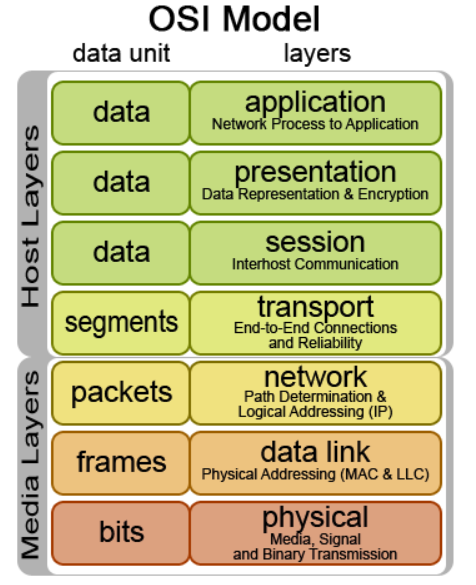
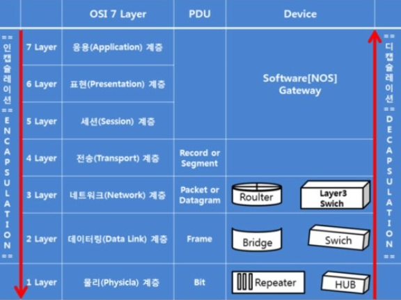
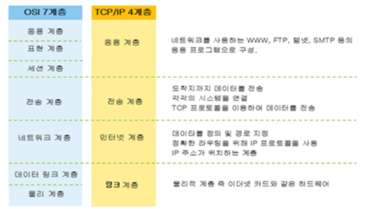
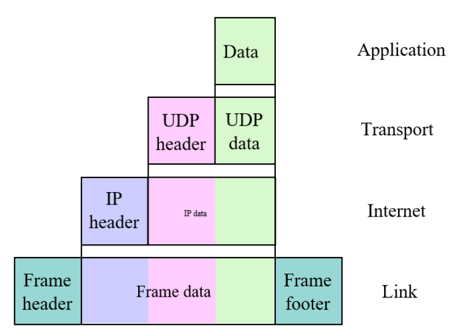

# 21.01.13

## 주요 질문

#### 💡 [질문1. OSI 7 Layer와 각 계층에 대한 설명을 해주세요.](#개념1)
   * OSI 7 계층은 국제 표준 기관 ISO가 **통신 접속부터 완료까지의 과정을 총 7단계로 정의**한 국제 통신 표준 모델입니다.
   
   * OSI 7 계층은 **Physical, Data Link, Network, Transport, Session, Presentation, Application**으로 구성되어 있습니다.

   * 최하위 계층부터 말씀드리자면, 1계층 **물리 계층**은 통신케이블을 통해 데이터를 전송하는 계층입니다. 통신 단위는 bit 이며 데이터를 전기신호로, 전기신호를 데이터로 바꿔줍니다. 단, 데이터를 전송하기만 할뿐 무슨 데이터인지는 신경을 쓰지 않습니다. 

   * 2계층 **데이터링크 계층**은 송수신하는 정보가 안전하게 전달하도록 서비스하는 계층입니다. 이 계층에서는 MAC address 를 가지고 통신을 하며 전송 단위가 프레임이며 오류 검출과 흐름 제어를 통해 안전하게 도달하도록 합니다.

   * 3계층 **네트워크 계층**은 시스템간 연결성과 경로 선택을 제공하는 역할을 하는 계층입니다. IP address 를 이용하여 라우팅 프로토콜이 연결된 네트워크를 통한 최적경로를 선택합니다.

   * 4계층 **전송계층** 은 데이터의 전송을 위한 논리적인 연결을 하는 대문같은 역할을 합니다. 신뢰성 있는 전송을 보장하기 위해 오류 검출 및 복구와 흐름 제어를 제공합니다.

   * 앞의 4개의 계층은 데이터 전송과 관련된 계층이라하면 앞으로의 3개 계층은 어플리케이션과 관련있는 서비스를 제공합니다. 5계층 **세션계층**은 사용자간의 연결, 세션을 구축하고 관리하는 역할을 합니다.

   * 6계층 **표현계층**은 세션 계층 간의 주고받는 인터페이스를 일관성 있게 제공합니다. 데이터 표현이 상이한 응용 프로세스의 독립성을 제공하고 암호화 하는 역할을 합니다. 다루고 있는 데이터가 text인지 image 인지 등을 구분합니다.

   * 7계층 **응용계층**은 OSI 모델에서 가장 유저와 가까운 층으로서 상대방이 보낸 데이터의 최종 목적지가 됩니다. HTTP, FTP, SMTP 등이 이 계층에 속한 프로토콜입니다. 

 

#### 💡 [질문2. TCP/IP Layer와 각 계층에 대한 설명을 해주세요.](#개념2)
* TCP/IP Layer는 OSI 7 계층을 4계층으로 단순화한 모델입니다.

* **Link 계층**은 전기신호 또는 광신호로 바꾸어 전달하는 역할을 합니다.

* **인터넷 계층**에서 IP 프로토콜을 통해 패킷의 전달 경로를 결정합니다.

* **전송 계층**은 인터넷 계층에서 결정한 목적지까지 실제 데이터를 신뢰성 있게 전송하는 역할을 합니다. TCP와 UDP라는 프로토콜이 존재합니다.

* **Application 계층** 응용프로그램들 간의 데이터 통신이 이루어지는 계층입니다.

 

## 심화 질문

#### 💡 [질문 1 Encapsulation과 Decapsulation을 서로 비교하며 설명해주세요](#개념2) 
   * **Encapsulation**은 캡슐화로, 송신 데이터에 필요한 헤더 정보를 붙여 다음 계층에 보내는 것을 의미합니다. 헤더에는 제어 및 주소 정보를 명시합니다. 데이터를 보낼 때, 계층별로 헤더정보를 데이터에 추가됩니다.

   * **Decapsulation**은 헤더 정보를 제거하고 수신지의 계층까지 응용 데이터만을 보내는 것을 의미합니다.
   
#### 💡 질문2 OSI 7 Layer 또는 TCP/IP Layer에서 계층화하는 이유가 무엇인가요?
   * 각 계층별로 담당하는 역할을 나누기 위함입니다. 즉, 계층에 존재하는 각 프로토콜이 자신의 기능만 충실히 하도록 하여 **독립성을 보장**하기 위해서입니다. 만약 문제가 발생했을 때 해당 계층만 파악하면 됩니다.
   

 

## 개념 정리

### ⭐ 개념1
   * OSI 7 계층 구조별 PDA(Protocol Data unit)

      

   * OSI 7 계층 구조와 흐름

      

 

#### ⭐ 개념2
   * TCP/IP 계층

      TCP/IP란 인터넷과 관련된 다양한 프로토콜의 집합을 의미합니다.
      
      TCP 프로토콜과 IP 프로토콜이 각각 전송 계층, 인터넷 계층에서 **케이블 규격, IP 주소 지정방법, 통신 대상을 찾는 방법과 그곳에 도달하기 위한 순서 등을 제어하는 역할**을 합니다.

      

   * Encapsulation/Decapsulation

      

   * IP 프로토콜 in 인터넷 계층
      
      IP 프로토콜은 라우팅 방법을 정의하는 것입니다. 상위 계층인 전송 계층이 데이터 전달의 신뢰성을 책임진다는 가정하에 어떤 경로로 패킷을 전송할 것인가에 초점을 둡니다.

   * TCP 프로토콜 in 전송 계층

      **TCP 프로토콜**은 신뢰성 있는 데이터의 전송을 담당합니다. 
      
      IP 프로토콜은 TCP가 데이터를 보낼 때 기반이 되는 프로토콜입니다. IP 계층은 문제가 발생해도 해결해주지 않는 신뢰되지 않은 프로토콜입니다.
      
      이 문저젬을 해결해 주는 것이 TCP 프로토콜입니다. 
      TCP 프로토콜은 데이터가 순서에 맞게 올바르게 전송이 갔는지 확인을 해줍니다. 즉, TCP는 신뢰성 없는 IP에 신뢰성을 부여한 프로토콜입니다.