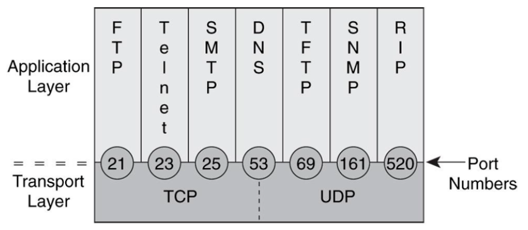
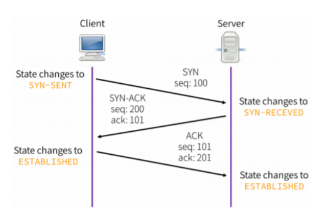
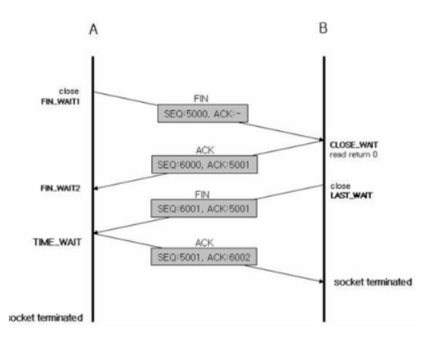

# 21.01.13

## 주요 질문
   
#### 💡 질문1. 프로토콜이란 무엇인가요?
   * 컴퓨터간 데이터 통신을 원활하게 하기 위해 규정한 규약입니다. 프로토콜에는 신호 송신의 순서나 표현법, 오류 검출법 등을 정해둡니다.

#### 💡 [질문2. TCP와 UDP의 차이점은 무엇인가요?](#개념1)
   * TCP 프로토콜은 연결 지향적이며, 신뢰성이 보장된다는 특징이 있습니다.
   
     이와 달리, UDP 프로토콜은 비연결 지향적이며, 성능이 빠르다는 특징이 있습니다.

   
#### 💡 [질문3. TCP 3 way handshaking이 무엇인가요?](#개념2)

   * 클라이언트와 서버가 통신을 하기전 정확한 전송을 보장하기 위해 컴퓨터간 세션을 수립하는 과정으로서 TCP 프로토콜에서 신뢰성을 보장하기 위해 사용됩니다.

#### 💡 [질문4. TCP 4 way handshaking이 무엇인가요?](#개념2)
   
   * 클라이언트와 서버가 연결하기 위해 3-way handshaking 과정이 필요하듯이 연결을 종료할때에도 데이터 손실없는 전송을 보장하기 위해 handshaking 과정이 필요한데 이것이 4-way handshaking 입니다.

 

## 심화 질문

#### 💡 [질문1. TCP를 사용하는 대표적인 프로토콜은 무엇인가요?](#개념1)
   * HTTP가 있습니다. HTTP 프로토콜은 한 문서에서 다른 문서로 즉시 접근할 수 있는 텍스트를 하이퍼텍스트라고 하는데 이 텍스트를 전송하는 규약을 말한다.

#### 💡 [질문2. 서버가 마지막에 FIN 을 보내는 이유는 무엇인가요?](#개념2)
   * 서버가 아직 클라이언트에 보낼 데이터가 남아있을 경우 데이터를 다 전송하지도 못한채 클라이언트에서 포트를 닫아버리게 되므로 서버 또한 종료될 준비가 되었다는 의미로 FIN 을 보내게 됩니다.

 
#### 💡 [질문3. 클라이언트가 마지막에 ACK 를 굳이 보내는 이유는 무엇인가요?](#개념2)  
   * 서버가 보낸 종료 신호를 클라언트가 받지 못 할 경우 클라이언트는 종료가 되지 못한채 계속 기다리게 됩니다.하지만 서버는 이미 포트를 닫고 더이상 응답을 안하는 상태이기에 클라이언트는 불필요한 자원을 소모하게 됩니다.

 

## 개념 정리

### ⭐ 개념1
   * TCP

      **연결 지향 프로토콜**
      
      TCP 프로토콜에서는 데이터 송수신을 위해 클라이언트와 서버의 소켓이 연결되어 있어야 하며, 데이터가 유실되면 데이터 재전송을 요청함으로써 신뢰성을 보장합니다.즉, 신뢰성 있는 데이터 전송이 가능하다는 장점으로 인해 HTTP, FTP, TELNET 등 대부분의 응용 계층 프로토콜의 전송 계층으로 사용 됩니다.

   * UDP
   
      **비연결 지향 프로토콜**
      
      전송한 데이터가 잘 전달이 되었는지 확인하지 않고 단지 데이터만 보낸다는 점이 TCP 프로토콜과 다릅니다. 즉, 신뢰적이지 않으며( 비신뢰성 ), 대신 **속도가 빠르다**는 장점이 있습니다. 하지만 UDP 프로토콜이 아예 신뢰성이 없다는 것은 아닙니다. 헤더에 checksum 존재합니다. 그래서 UDP 프로토콜은 음악이나 동영상 스트리밍(streaming)과 같은 서비스에 적합합니다.

   * TCP/UDP 주요 프로토콜

     

 

   

    
출처

    https://victorydntmd.tistory.com/288
  

#### ⭐ 개념2
   * 3 way handshaking
     
     ✅ TCP 연결 시작
     
     

   TCP는 세그먼트를 이용하여 시스템의 데이터 수신 준비를 확인하고 다음과 같은 절차를 밟은 후 데이터를 보내게 됩니다. 

   >1. 송신 : 통신하고 싶어요. SYN를 보낼게요.
   >
   >2. 수신 : 그래? 나도 통신 준비 됬어요! SYN-ACK
   >
   >3. 송신 : 그래? 그러면 보낼게  ACK

   TCP 초기 연결 과정 이후에는 송신 TCP는 다른 ACK세그먼트를 보낸 다음 계속 데이터를 보내게 됩니다. 

   * 4 way handshaking
     
     ✅ TCP 연결 종료
     
     

>1. 먼저 클라이언트가 연결을 닫으려 할 떄 FIN 으로 설정된 세그먼트를 보냅니다. 
>
>2. 클라이언트는 FIN_WAIT_1상태로 들어가고 서버의 응답을 기다립니다. 
>
>3. 서버는 클라이언트로 ACK라는 승인 세그먼트를 보냅니다. 
>
>4. 클라이언트가 세그먼트를 받으면 FIN_WAIT_2상태에 들어갑니다. 
>
>5. 서버는 ACK를 보낸 후 일정시간 이후에 FIN이라는 세그먼트를 보냅니다. 
>
>6. 클라이언트는 받게 되면 TIME_WAIT상태가 되고 다시 서버로 ACK를 보내서 서버는 CLOSED상태가 됩니다. 
>
>7. 클라이언트는 30초에서 2분동안 대기 후 연결이 공식적으로 닫히고 클라이언트 측의 모든 자원의 연결이 해제 됩니다. 

   

    
출처

    https://m.blog.naver.com/PostView.nhn?blogId=jhc9639&logNo=221411218450&proxyReferer=https:%2F%2Fwww.google.com%2F
  

 
