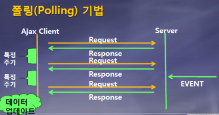
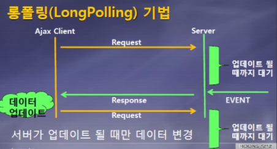
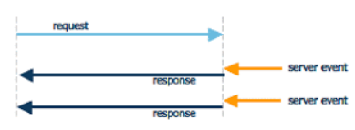

# 21.01.14

## 주요 질문

#### 💡 질문1. 클라이언트와 서버는 무엇인가요?

클라이언트는 서버에서 정보를 가져와서 사용자에게 보여줄 수 있고 **사용자와 상호작용할 수 있는 소프트웨어**입니다. 대표적으로 웹브라우저가 있습니다.

서버는 일반적으로 사용자가 직접적으로 사용하지 않지만, 네트워크 상에서 접근할 수 있는 프로그램입니다. 즉, **어떤 자료들에 대한 관리나 접근을 제어해주는 프로그램**을 말합니다.

#### 💡 질문2. 소켓이란 무엇인가요?

프로그램이 네트워크 상에서 데이터를 송신과 수신을 하기 위한 연결입니다. 일반적으로 TCP/IP 프로토콜을 이용하거나 WebSocket을 이용합니다.

#### 💡 질문3. HTTP와 웹소켓 차이점은 무엇인가요?

클라이언트의 요청이 있을 때만 서버가 응답하여 해당 정보를 전송하고 곧바로 연결을 종료하는 방식입니다. 즉, **HTTP에서 첫번째 요청과 두번째 요청 사이에 관계가 없기 때문에 stateless합니다.** 이 통신 방식은 필요한 경우에 서버로 접근하는 콘텐츠 위주의 데이터를 사용할 때 용이합니다. 

이에 반해 소켓 통신은 서버와 클라이언트가 특정 Port를 통해 실시간으로 양방향 통신을 하는 방식입니다. **서버와 클라이언트가 특정 Port를 통해 연결을 성립하고 있어 Stateful**합니다.  서버 역시 클라이언트로 요청을 보낼 수 있으며 실시간 통신이 필요한 경우에 자주 사용합니다.

 

## 심화 질문

#### 💡 질문1. 웹소켓 (WebScoket)과 TCP/IP 소켓의 차이점은 무엇인가요?

웹 소켓과 TCP/IP 소켓은 IP, PORT를 통해서 통신한다는 점에서는 비슷합니다. 하지만 웹 소켓은 애플리케이션 계층에 HTTP 계층에서 작동하는 소켓입니다. 반면 TCP/IP 소켓은 4계층 레이어에서 동작하는 소켓으로 조금 더 큰 개념입니다. 

#### 💡 질문2. Ajax는 무엇인가요?

AJAX란 JavaScript를 사용한 비동기 통신으로 클라이언트와 서버간에 XML 데이터를 주고받는 기술입니다. AJAX로 클라이언트에서 서버로 데이터를 요청하고 그것에 대한 결과만을 받아 적용할 수 있습니다. 이를 통해 **전체 페이지를 새로 고침하지 않고도 페이지의 일부에 대한 데이터를 로드**할 수 있습니다.

#### 💡 질문3. Ajax의 장점과 단점은 무엇인가요?

Ajax의 장점은 서버의 처리가 완료될 때까지 기다리지 않고 처리가 가능하기 때문에 웹페이지의 속도가 향상됩니다. 

AJAX의 단점은 연속으로 데이터를 요청하면 서버 부하가 증가할 수 있습니다. XMLHttpRequest를 통해 통신하는 경우에 사용자에게 아무런 진행 정보가 주어지지 않아 요청이 완료되지 않았는데 사용자가 페이지를 떠나거나 오작동하게 될 수 있습니다. 또한 동일-출처 정책으로 인하여 다른 도메인과는 통신이 불가능합니다. HTTP 클라이언트의 기능이 한정되어 있으며 AJAX를 쓸 수 없는 브라우저가 있습니다.

 

## ⭐ 개념 정리

### 개념1 HTTP web flow 방식
- Polling 

  **HTTP 프로토콜 "Stateless"**

  - Client가 요청을 보내는 경우에만 Server가 응답하는 단방향적 통신

  **클라이언트가 n초 간격으로 request를 서버로 계속 날려서 response를 전달받는 방식**

  기존 HTTP 통신의 경우에는 단방향 통신으로 실시간 통신을 하기 위해서는 실시간처럼 보이는 방식을 사용한다.

  목적

  - 하나의 장치(또는 프로그램)의 **충돌 회피** 또는 **동기화 처리**

  **Ajax호출을 사용**하여 setTimeout같은 타이머를 이용해서 일정한 시간 간격으로 XMLHttpRequest를 보내 구현한다.

  

- Long Polling

  **HTTP 프로토콜 "Stateless"**

  - Client가 요청을 보내는 경우에만 Server가 응답하는 단방향적 통신

  **HTTP로 일단 request를 보내놓고 timeout날 때까지 기다리다 중간에 보낼 데이터가 있다면 response를 보내주는 방식**

  - 클라이언트가 웹 서버에게 새로운 내용이 있는지 물어보았을 때 웹 서버에서 새로운 내용이 없다면 대답해 주지 않다가 새로운 내용이 생기면 이 때 대답해 준다.

  클라이언트에서 서버로 일단 http request를 날린다. 이 상태로 계속 기다리다가 서버에서 해당 클라이언트로 전달할 이벤트가 있다면 그순간 response 메시지를 전달하면서 연결이 종료된다. 클라이언트에서는 곧바로 다시 http request를 날려서 서버의 다음 이벤트를 기다린다.

  **한계**

  - 클라이언트로 보내는 이벤트들의 시간간격이 좁다면 polling 과 별 차이가 없게 되며, 다수의 클라이언트에게 동시에 이벤트가 발생될 경우에는 곧바로 다수의 클라이언트가 서버로 접속을 시도하면서 서버의 부담이 급증하게 된다.

  

  

   

    
출처

    https://adrenal.tistory.com/20
  

### 개념2 Socket 통신

#### Web Socket

**WS 프로토콜 "Stateful"** 

- 라이언트와 서버가 양방향 통신을 하는 방식

Polling, Streaming 방식의 AJAX 코드를 이용하여 이를 구현하였다. **HTML5 표준의 일부**로 WebSocket이 만들어지게 되었다.

**일반 TCP Socket과의 차이점**

- HTTP에서 Websocket으로의 프로토콜 전환(WebSocket HandShake)을 거쳐야한다. 즉, **웹 소켓은** **기존 HTTP 통신을 대체하지 않는다.** 또한 웹 소켓은 트래픽이 많고 지연이 낮은 접속 환경에서 유리하다.

서버로 동영상을 요청하기 위해서는 동영상이 종료되는 순간까지 계속해서 Http 통신을 보내야 하고 이러한 구조는 계속 연결을 요청하기 때문에 **부하**가 걸리게 된다. 이러한 경우에는 Socket을 통해 구현하는 것이 적합하다.

