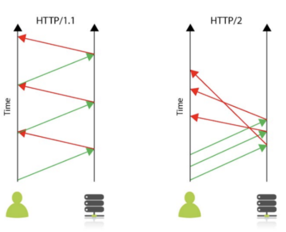
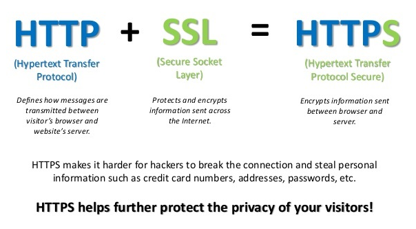
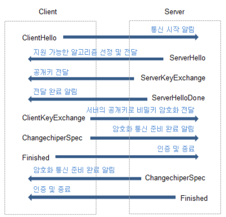
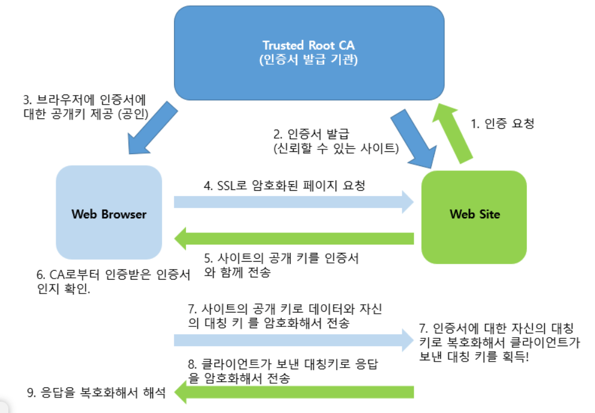
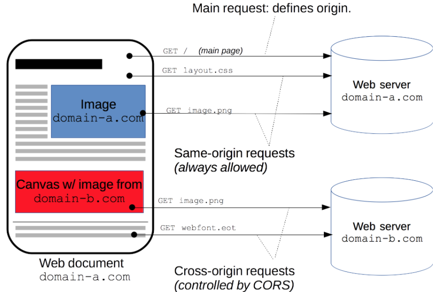
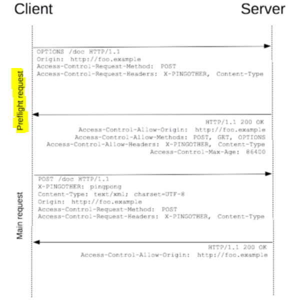

# 21.01.15

## 주요 질문

#### 💡 [질문1. HTTP와 HTTPS 차이점은 무엇인가요?](#개념2)

HTTP 란 일반적으로 **웹 서버 통신을 위한 프로토콜**입니다. 하지만 HTTP 프로토콜을 사용하면 패킷을 가로챌 수 있기 때문에 위험합니다. HTTP에서 전달되는 패킷은 평문이기 때문에 중간에 데이터를 갈취하여 변조해서 공격이 가능합니다.

HTTPS는 **암호화된 통신을 제공하는 HTTP** 입니다. 즉, HTTP 를 이용해 클라이언트와 서버가 통신을 할때 암호화 통신을 하기 위해 **키**를 설정하고 통신을 하게 됩니다. 이 때 사용되는 암호화 방식은 **공개키 암호화방식**을 사용합니다.

하지만 HTTPS로 암호화 통신을 하기 때문에 공개키 암호화와 복호화 과정은 많은 비용이 발생합니다. 따라서 HTTPS 통신은 HTTP 에 비해 상대적으로 느리기 때문에 기밀 또는 민감한 개인정보들의 경우 사용합니다.

#### 💡 [질문2. CORS는 무엇인가요?](#개념3)

CORS(Cross-Origin-Resource-Sharing)란 **HTTP 통신을 할 때 추가적으로 HEADER 구간에 CORS 관련을 입력하여서 다른 출처의 자원을 허용하는 방식**입니다. 웹 애플리케이션은 리소스가 자신의 **도메인, 프로토콜, 포트** 중 다른 부분이 있을 때 교차 출처 HTTP 요청을 실행합니다.

 

## 심화 질문

#### 💡 [질문1. HTTP1.1와 HTTP2.0 차이점은 무엇인가요?](#개념2)

 http1.1은 기본적으로 **연결 하나당 하나의 요청을 처리**하도록 설계되어 있습니다. 연결당 하나의 요청과 응답을 처리하기 때문에 하나의 응답이 지연될 시 해당 응답이 완료될 때 까지 다음 요청은 **무한대기상태**가 됩니다.

또한 **양방향(round trip) 시간이 ** 증가하는 문제가 생깁니다. 3-way Handshake가 반복적으로 일어나게 되어 불필요한 RTT 증가와 네트워크 지연을 초래합니다. 

또한 요청 시마다 중복된 헤더값을 전송하게 되고, 해당 도메인에 설정된 cookie 정보도 매 요청시 헤더에 포함되어 **전송하려는 값보다 헤더 값이 더 클 수가 있습니다.**

http2.0은 http1.1이 이러한 부분으로 인해 느려서 개선한 것입니다. http 2.0은**동시에 하나의 연결에 여러 개 요청을 주고 받을 수 있습니다.** 요청 리소스간의 우선순위를 설정할 수 있습니다.

#### 💡 질문2. 대칭키 암호화 방식은 무엇인가요?

암호화와 복호화에 **똑같은 암호키**를 쓰는 암호화 알고리즘입니다. 즉, 암호화 된 정보를 전달하고 확인하기 위해서는 송신자와 수신자 모두 똑같은 키를 가지고 있어야 합니다. 키를 안전하게 교환하고 가지고 있어야 합니다. 

#### 💡  질문3. 비대칭키 또는 공개키 암호화 방식은 무엇인가요?

암호화와 복호화에 **서로 다른 암호키**를 쓰는 알고리즘입니다. 암호화에 개인키 또는 공개키를 사용할 수 있습니다. 공개키는 누구나 알 수 있도록 공개된 키입니다. 따라서 어떤 정보를 특정 사용자에게 보낼 때 해당 사용자의 공개키로 암호화하여 전송합니다. 해당 공개키에 대응하는 개인키를 가진 사용자만 암호화 데이터를 복호화할 수 있습니다. 이를 통해 대칭키에서 키값 교환에 따른 문제를 해결할 수 있습니다.

#### 💡 [질문4. CORS preflight는 무엇인가요?](#개념3)

preflight request는 실제 요청을 보내도 안전한지 판단하기 위해 사전에 보내는 요청입니다. OPTIONS 메서드로 요청하며 CORS를 허용하는지 확인합니다. CORS가 허용된 웹서버라면 사용 가능한 리소스를 헤더에 담아 응답합니다.

 

## ⭐ 개념 정리

### 개념1

#### HTTP 1.1

#### HTTP 2.0

	- Multiplexed Streams
	- Stream Prioritization
	- Server Push
	- Header Compression

 
출처

 https://it-mesung.tistory.com/159

### 개념2

   * HTTP

      **Hyper Transfer Protocol의 약자로서, HTML을 전송하기 위한 통신규약**

      **기본포트 80**

      **네트워크 - IP - TCP - HTTP** 계층 구성

      

   * HTTPS
   
      **SSL/TLS 계층 위에서 동작하는 HTTP**
      
      **기본포트 443**

      **네트워크 - IP - TCP - SSL/TLS - HTTPS** 계층 구성
      
      **HTTPS = HTTP + TLS**

      - TLS는 HTTP, FTP, SMTP 프로토콜 포함

   

   * **SSL/TLS**

     **인터넷에서 데이터를 안전하게 전송하기 위한 인터넷 암호화 통신 프로토콜 **
     
     **보안 소켓 계층, 응용계층과 전송계층 사이에 독립적인 프로토콜 계층을 만들어서 동작**
     
     데이터 송신과정에서 HTTP와 HTTPS 차이점
     
     - HTTP
     
       -  **애플리케이션 계층 HTTP ↔ 전송 계층 TCP**
     
     - HTTPS
     
       - **애플리케이션 계층 HTTP → SSL (암호화)  → 전송 계층 TCP**
       -  **애플리케이션 계층 HTTP ← SSL (복호화) ← 전송 계층 TCP**
     
       Application은 SSL을 TCP로 인식하고, TCP는 SSL을 Application으로 인식하기 때문에 **Application과 TCP사이의 데이터 전달 방식은 기존 전달 방식을 그대로 사용**
     
       
     
* **SSL 통신 방식**

     

     

     SSL은 서드 파티**CA(Certificate Authority)** 로부터 서버와 클라이언트의 인증한다. **공개키 암호방식 + 대칭키 암호방식**

     

     > (1) 클라이언트가 SSL로 암호화된 페이지를 요청한다.
     >
     > (2) 인증기관은 정보를 면밀히 검토한뒤, 사이트의 정보와 공개키를 **자신의 비밀키로 암호화**한다.
     >
     > (3) 인증기관은 **인증기관의 비밀키로 암호화된 사이트의 정보와 공개키**를 사이트에 송신한다. 
     >
     > (4) 서버는 **공개키(Public key)와 인증서**를 전송한다.
     >
     > (5) 클라이언트는 인증서가 Trusted root 인증기관 CA로부터 서명된 것인지, 날짜 등이 유효한지를 확인한다.
     >
     > (6) 클라이언트는 인증 완료된 인증서에서 **서버의 공개키를 추출**한다. 클라이언트는 **서버의 공개키로 임의 메세지와 자신의 대칭키를 암호화**하여 서버에 전송한다.
     >
     > (7) 서버는 **공개키로 임의의 메세지를 복호화**한다. 그리고 서버는 클라이언트에게 전달받은 **대칭키로 서버의 응답을 암호화**하여 클라이언트와 통신한다.(https://)
     >
     > (8) 클라이언트는 **대칭키로 응답을 복호화**한다.

     6, 7번 과정에서 서명을 통한 인증 과정이 이루어진다. 서명 과정은 다음과 같다.

     > (1) 해쉬 생성
     >
     > (2) Private key로 해쉬 암호화
     >
     > (3) 암호화된 해쉬와 서명된 인증서를 메시지에 추가
     >
     > (4) 받는 사람은 따로 해쉬를 생성
     >
     > (5) 받은 메시지에 포함된 해쉬를 Public key를 이용해서 복호화
     >
     > (6) 생성된 해쉬를 비교한다.

   

    
출처

    https://m.blog.naver.com/xcripts/70122755291
  

### 개념3

URL에는 Protocol+HOST+PORT (ex: [https://www.naver.com:8000](https://www.naver.com:8000/)) 이 3개의 조합으로 자원의 출처를 구분한다.

이 출처가 다르다면 Same-Origin Policy에 걸려서 브라우저에서 에러를 발생시킨다.

하지만, 웹이라는 환경에서 다른 출처의 이미지/링크/기타 등등 다른 자원을 사용못하는 것은 불가능하기 때문에 CORS 조약을 충족하는 자원에 대해서 공유를 할 수 있도록 한다.

#### CORS 시나리오1 : Preflight Request

**브라우저는 요청을 한번에 다 보내지 않고 예비요청과 본 요청을 나누어서 보내게 된다.** 여기서, 예비요청이 바로 영어로 Preflight Request인다. 이렇게 하는 이유는 먼저 해당 서버에서 어떤 출처와 방식을 허용하는지 미리 확인하고 그 다음 본 요청을 보내기 위함이다.

1. 브라우저는 HTTP method 중 **OPTIONS**를 이용해서 다음 조건을 확인한다.
   - Origin : 출처 정보 (서버에서 허락한 출처의 요청인지 검사)
   - Access-Control-Request-Method : HTTP METHOD가 유효한지 검사
   - Access-Control-Request-Headers : 본 요청에 HTTP의 HEADER가 유효한지 검사
2. 서버는 해당 예비요청에 대한 응답으로 허락된 정책에 대한 정보를 제공
   - Access-Contorl-Allow-Origin : 서버가 허락한 출처들 (Protocol + Host + Port)
   - Access-Control-Allow-Methods : 허락한 HTTP Method 리스트 업
   - Access-Control-Allow-Headers : 허용되는 HEADERS 정보 (* 와일드 카드시 전부 허용하지만, Authorization은 따로 명시해야됨)
   - Access-Control-Max-Age : 서버가 preflight요청에 대한 응답의 수명 (초 단위)

#### CORS 시나리오 2 :  Simple Request

본 요청(Simple Request)으로, 예비 요청을 보내지 않고, 바로 HTTP Request를 하는 방식

#### CORS 시나리오 3 : Credential Request

인증된 요청을 사용하는 방법이다. 브라우저가 제공하는 리소스 요청인 `XMLHttpRequest` 객체나 `fetch` 는 기본적으로 인증과 관련된 쿠키나 헤더를 요청에 함부러 담지않고, `credentials`옵션을 적용해야지 담을 수 있다. `credential`은 3가지 옵션을 가지며 다음과 같이 `fectch`를 사용할 때 옵션값을 설정하여 요청을 보낼수 있다.

- Credentials 옵션
  - same-origin (기본값) : 같은 출처간의 요청에만 인증 저보를 담을 수 있다.
  - include : 모든 요청에 인증 정보를 담을 수 있다.
  - omit : 모든 요청에 인증정보를 담을 수 없다.

 
출처

 https://velog.io/@sj950902/CORS%EC%99%80-SOP%EC%97%90-%EB%8C%80%ED%95%B4-%EC%95%8C%EC%95%84%EB%B3%B4%EC%9E%90-1%ED%83%84

