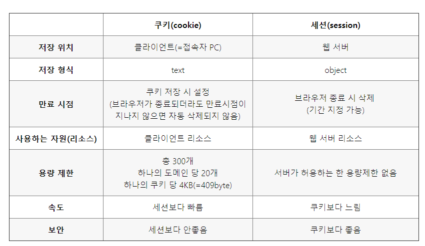
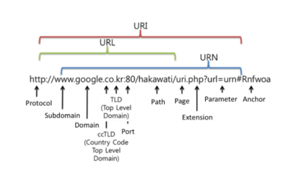

# 21.01.18

## 주요 질문

#### 💡 [질문1. 쿠키와 세션에 대해 설명해주세요](#개념1)

쿠키와 세션을 사용하는 이유는 HTTP(Hypertext Transfer Protocol)의 비연결성(Connectionless)과 비상태성(Stateless)이라는 특징을 보완하기 위해서 사용됩니다. 

쿠키는 방문자의 정보를 사용자 컴퓨터의 메모리에 저장하는 것을 말합니다. 대표적으로 사용자가 방문한 사이트를 저장하는데 사용됩니다.

세션은 메모리에 저장하는 것이 아닌 웹 서버에서 사용자를 식별할 수 있는 세션id 파일을 만들어 저장하는것을 말합니다. 세션은 사용자가 웹사이트에 방문하여 계속 접속을 유지할 때 이전의 접속 정보를 이용할 수 있는 방법으로 많이 사용됩니다.

#### 💡 [질문2. Restful API에 대해 설명해보세요](#개념2)

RESTful API는 **REST를 기반으로 서비스 API**를 구현한 것입니다. REST는  **HTTP URL을 통해 자원을 명시하고, HTTP Method(POST, GET, PUT, DELETE)를 통해 해당 자원에 대한 CRUD를 적용**하는 것입니다. 최근 서버 프로그램은 다양한 브라우저와 모바일 디바이스에서도 통신을 할 수 있어야 합니다.

#### 💡 [질문3. GET방식과 POST 방식의 차이점을 설명해보세요](#개념3)

둘 다 HTTP 프로토콜을 이용해서 클라이언트가 서버에 무엇인가를 요청할 때 사용하는 방식입니다.

GET 방식은 서버에서 **데이터를 가져와서 보여주고 싶을 경우**에 사용됩니다. GET 요청은 URL 주소 뒤에 파라미터를 붙여서 데이터를 전달하는 방식입니다. 특히나 <form> 태그에서의 GET 방식은 서버로 전송하는 과정에서 서버 처리가 지연될 경우 중복해서 요청이 이루어진다는 문제가 발생할 수 있다는 단점을 가지고 있습니다.

POST방식에서 **서버의 값이나 상태를  추가하거나 변경**하기 위해서 사용됩니다. POST 요청에서 사용자가 입력한 데이터를 URL 주소에 붙이지 않고 HTTP Request 헤더에 포함시켜서 전송을 시키는 방식을 말합니다. **객체 형식의 데이터도 전송이 가능**하지만  **캐시되지 않으며 브라우저 히스토리에도 남지 않습니다.** 따라서 **뒤로가기와 북마크가 불가능**합니다.

 

## 심화 질문

#### 💡 질문1. Cookie, Session Storage, Local Storage 사이 차이점을 설명해주세요

세 가지 모두 클라이언트에서 데이터를 저장하는 key-value 저장소 매커니즘입니다. 모두 문자열로 값을 저장합니다. 

쿠키는 약 **4KB(4096bytes)**까지 밖에 저장 공간을 이용하지 못하는 반면에 Session Storage와 Local Storage는 약 **5MB**까지 저장 공간을 이용할 수 있습니다.

LocalStorage는 웹 스토리지 API의 종류에는 브라우저를 종료해도 데이터를 저장하고 있습니다. sessionStorage는 브라우저를 종료하면 데이터가 소멸됩니다.

#### 💡 질문2. Rest API와 SOAP에 대해 각각 설명하고 차이점을 설명해주세요

SOAP(Simple Object Access Protocol)은 HTTP,  HTTPS 등을 통해 **XML 기반 메시지를 교환**합니다. 목적은 SOA를 구현하는 규약입니다.

Rest API(Representational State Transfer)은 HTTP, HTTPS 등을 통해 CRUD를 실행하는 API입니다. 목적은  중간매체없이 클라이언트-서버구조로 직접 주고받는 ROA를 구현하기 위한 규약입니다.

#### 💡 [질문3.  url과 uri에 대해 각각 설명해주세요](#개념4)

URI가 URL 보다 더 큰 개념 입니다. URL은 인터넷 상의 자원 위치를 나타냅니다.

예를 들면, http://localhost:8000/list 이것은 URI 이고 URL 입니다. 하지만 http://localhost:8000/list?search=kwon은 URI라고는 할 수 있으나 URL이라고는 할 수 없습니다. 왜냐하면 ?search=kwon은 어떤 위치를 나타내는 것이 아닌, 검색의 조건을 나타내는 부분이기 때문입니다. ?search 이전은 URL이고 URI라고 할 수 있습니다.

 

## ⭐ 개념 정리

### 개념1

#### 비연결성과 비상태성

- 비연결성: 클라이언트가 서버에 요청(request)을 했을 때, 그 요청에 맞는 응답(response)을 보낸 후 연결을 끊는 처리방식
-  비상태성: 클라이언트의 상태 정보를 가지지 않는 서버 처리 방식

HTTP의 비연결성과 비상태성 특징으로, 첫번째 통신에서 클라이언트와 데이터를 주고 받았다 해도, 두번째 통신에서는 이전 데이터를 유지하지 않는다. 

#### cookie vs session

 
출처

 https://wooaoe.tistory.com/55

### 개념2

#### REST 정의

REST는 월드 와이드 웹(www)과 같은 분산 하이퍼미디어 시스템을 위한 소프트웨어 개발 아키텍처의 한 형식

기본적으로 웹의 기존 기술과 HTTP 프로토콜을 그대로 활용하기 때문에 웹의 장점을 최대한 활용할 수 있는 아키텍처 스타일

HTTP 표준 프로토콜에 따르는 모든 플랫폼에서 사용이 가능

#### REST 필요한 이유

"애플리케이션 분리 및 통합"
"다양한 클라이언트의 등장"

#### REST 구성

- 자원 URI
- 행위 HTTP Method
- 표현 Representation

#### REST 특징

- Uniform Interface

  **"인터페이스 일관성"**

  - 특정 언어나 기술에 종속되지 않고 HTTP 표준 프로토콜을 따르는 모든 플랫폼에 사용이 가능
  - URI로 지정한 리소스에 대한 조작이 가능

- Stateless

  **"무상태성, 서버는 클라이언트의 context를 모른다"**

  - HTTP 프로토콜은 Stateless하다

- Cacheable

  - HTTP 프로토콜의 캐싱 기능 적용

- Self-descriptiveness

  - 동사(HTTP Method) + 명사(URI)
  - JSON

- Client - Server 구조

  **"클라이언트는 자원 요청하는 쪽, 서버는 자원을 가지고 있는 쪽"**

  - 클라이언트와 서버에서 개발해야 할 내용이 명확해지고 각각의 역할이 확실히 구분되어 서로간 의존성이 줄어듬

- 계층형 구조

  **"클라이언트는 REST API 서버만 호출"**

  -  API 서버는 순수 비지니스 로직을 수행하고, 그 앞단에 사용자 인증, 암호화(ssl), 로드밸런싱 등을 하는 계층을 추가하여 구조상의 유연성을 둘 수 있음

 
출처

 https://gmlwjd9405.github.io/2018/09/21/rest-and-restful.html

### 개념3

#### HTTP 요청

- HTTP란
  - 클라이언트와 서버 간의 통신을 가능하게하도록 설계되어 클라이언트와 서버 간의 요청-응답 프로토콜로 작동한다.
- HTTP Method
  - GET
  - POST
  - PUT
    - **리소스를 생성 / 업데이트하기 위해 서버로 데이터를 보내는 데 사용**
  - DELETE
  - HEAD
    - **GET과 거의 동일하지만 응답 본문이 없음**
  - OPTIONS
    - **대상 자원에 대한 통신 옵션을 설명**

 
출처

 https://www.w3schools.com/tags/ref_httpmethods.asp

### 개념4

- URI
  - 네트워크 상 자원을 가리키는 일종의 고유 식별자(ID)
- URN (Uniformed Resource Name)
- URL (Uniformed Resource Locator)

 
출처

 https://programming119.tistory.com/194

