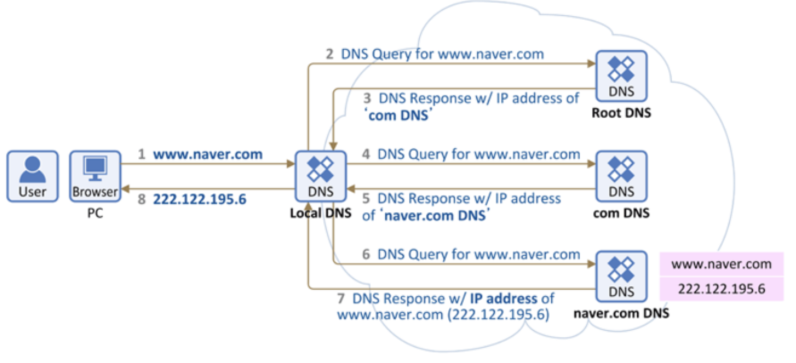

# 21.01.19

## 주요 질문

#### 💡 [질문1. 도메인과 DNS가 무엇인지 설명해주세요](#개념1)

도메인은 **네트워크상에서 컴퓨터를 식별하는 호스트명**을 말합니다. 즉, 도메인은 IP주소를 알기 쉬운 문자열로 매핑한 것이라고 할 수 있습니다. 모든 웹페이지의 IP주소를 외우거나 매번 메모하는 것이 불편하여 도메인(Domain)이라는 개념이 등장했습니다. 

DNS서버는 IP주소와 도메인의 매핑정보를 관리합니다. 도메인 혹은 IP 주소를 묻는 요청이 오면 이에 응답합니다. 또한 DNS에도 캐시가 있어서, 자주 요청을 받는 정보는 캐시로 관리할 수 있습니다.

#### 💡 질문2. 브라우저 주소창에 "www.naver.com"을 입력했을 때 DNS 서버에서의 처리 과정과 브라우저의 동작과정을 통틀어서 설명해주세요.

**브라우저에서** 먼저 URL에 입력된 값을 파싱하여, 브라우저 내부 규칙에 따라 HTTP 요청 메세지를 만든다. 만든 메세지를 웹 서버로 전송합니다. 웹 브라우저는 네트워크 송출기능이 없기 때문에 메시지를 직접 전송을 하는것이 아니라 운영체제에 의뢰를 하게 됩니다. 이 때 브라우저는 메시지를 받을 상대 도메인이 아니라 ip 주소로 변환하여 운영체제에게 부탁해야합니다. 따라서 DNS서버를 조회하게 됩니다.

**프로토콜 스택(운영체제에 내장된 네트워크 제어용 소프트웨어, TCP/IP 계층)**에서브라우저가 보낸 메시지를 받습니다. 브라우저로부터 받은 메시지를 패킷 속에 저장합니다. 그리고 수신 주소와 같은 제어정보를 덧붙입니다. 그 패킷은 **LAN 어댑터**에 넘겨집니다. LAN 어댑터는 패킷을 전기 신호로 변환시켜 LAN 케이블에 송출합니다.

LAN 어댑터가 보낸 패킷은 **스위칭 허브**를 경유하여 **인터넷 접속용 라우터**에 도착합니다. 라우터는 패킷을 ISP(통신사)에 전달합니다. 해당 패킷은 인터넷으로 들어가게 됩니다.

패킷은 **액세스 회선**으로 통신사용 라우터(POP, Point Of Presence)까지 운반됩니다. POP를 거쳐 인터넷의 핵심부로 들어가게 됩니다. 고속 라우터들 사이로 목적지까지 패킷이 흘러가게 됩니다.

인터넷 핵심부를 통과한 패킷은 목적지의 LAN에 도착하게 됩니다. **방화벽**이 패킷을 검사하여 캐시서버로 보냅니다. **캐시서버**에서 웹 서버까지 가야하는지 가지않아도 되는지 검사합니다.

물리적 웹 서버에 패킷이 도착하면, **웹 서버의 프로토콜 스택**이 패킷을 추출하여 메시지를 복원합니다. 최종적으로 **웹 서버 애플리케이션**으로 넘긴다. 애플리케이션은 요청에 대한 응답 데이터를 넣어 클라이언트로 보냅니다. 왔던 방식대로 응답 메시지가 클라이언트에게 전달됩니다.

#### 💡 질문3. 서버에 트래픽이 주어졌을 때 어떻게 응답속도를 개선할 수 있는가요

서버의 **스케일 아웃과 스케일업**으로 응답속도를 개선할 수 있습니다. 스케일 업(Scale Up)은 서버에 CPU나 RAM 등을 추가하여 **서버 자체의 성능을 향상**시키는 것입니다. 스케일 아웃(Scale Out)은 **기존 서버와 동일하거나 낮은 서버를 여러 대 증설하여 운영하는 것**입니다.

 

## 심화 질문

#### 💡 [질문1. DNS round robin 방식의 문제점과 해결방법을 설명해주세요](#개념1)

서버의 수만큼 공인 IP 주소가 필요합니다. 즉, 서버 부하 분산을 위해 부하 분산을 위해 서버의 대수를 늘린다면 그 만큼의 공인 IP가 필요하다는 것입니다.

균등하게 분산되지 않습니다. 예를 들자면 PC 용 웹 브라우저도 **DNS 질의 결과를 캐싱**하기 때문에 균등하게 부하분산 되지 않습니다. DNS 레코드의 TTL 값을 짧게 설정함으로써 어느 정도 해소가 되지만, TTL 에 따라 캐시를 해제하지 않습니다.

DNS 서버는 웹 서버의 부하나 접속 수 등의 상황에 따라 질의 결과를 제어할 수 없습니다. 서버의 부하가 높아서 응답이 느려지거나 접속수가 꽉 차서 접속을 처리할 수 없는 상황인 지를 전혀 감지할 수가 없기 때문입니다.

Least Connection 방식으로 클라이언트와 연결이 적은 서버를 선택합니다. 로드밸런서가 실시간으로 각 서버에 대해 연결 상태를 관리하거나 각 서버에서 주기적으로 로드밸런서에 알려 주는 것이 필요합니다.

Weighted round robin (WRR)방식으로 처리 능력이 높은 서버가 빈번하게 선택될 수 있도록 합니다. 이 방식은 각각의 웹 서버에 가중치를 주어 분산 비율을 변경합니다. 

#### 💡 질문2. DHCP 서버의 역할을 간단히 설명해주세요

DHCP는 **호스트의 IP주소 및 TCP/IP 설정을 클라이언트에 자동으로 제공**하는 프로토콜입니다. 수동으로 일일이 할당하면 관리자가 오버헤드가 발생하기 때문입니다. 

사용자 PC는 DHCP서버에서 **사용자 자신의 IP주소, 가장 가까운 라우터의 IP주소, 가장 가까운 DNS서버의 IP주소**를 받습니다. 이후, **ARP 프로토콜을 이용하여 IP주소를 기반으로 가장 가까운 라우터의 MAC주소**를 알아냅니다. 

따라서 인터넷 가입할 때 일일히 TCP/IP 프로토콜 환경설정 값을 입력할 필요가 없습니다.

#### 💡 질문3.  L4 로드 밸런싱과 L7 로드 밸런싱에 대해 설명하고, 차이를 말해보세요

 L4 로드 밸런싱은 **Layer 4**(네트워크 계층 또는 트랜스포트(전송) 계층) 의 정보를 바탕으로 트래픽을 분산하는 방식입니다. 즉, TCP, UDP, IP 정보들을 바탕으로 분산하는데요. 이는 정보가 어떻게 생겼는지 보지 않고 **패킷 레벨에서만 트래픽을 분산**하기 때문에 속도가 빠르고 효율성이 높습니다. 그리고 L7 로드 밸런싱보다 저렴합니다.

반면, L7 로드 밸런싱은 **Layer 7**(애플리케이션(응용) 계층) 의 정보를 바탕으로 요청을 분산합니다. **HTTP Header, Cookie 등과 같이 사용자가 요청한 정보들을 바탕으로 트래픽을 분산**하기 때문에 섬세한 라우팅이 가능하고 비정상적인 트래픽을 판별할 수 있습니다. 하지만, L4 로드 밸런싱보다 비용이 높습니다.

 

## ⭐ 개념 정리

### 개념1

#### Host와 IP

- Host : 인터넷에 연결된 컴퓨터

- IP address : Host끼리 통신을 하기 위해 필요한 주소

#### URL과 도메인

- http://www.naver.com/index.html : 이런 형식을 **URL**이라고 부른다.
- [www.naver.com](http://www.naver.com/) : 이런 형식을 **Host Name**이라고 부른다.
- .com : 이것은 **Top-level Domain Name**이라고 부른다.
- .naver.com : 이것은 **Second-level Domain Name**이라고 부른다.

#### DNS 서버

DNS Server는 IP 주소와 Domain 이름을 기억하는 기능과 Client가 Domain 이름을 물어보면 IP를 알려준다.

#### DNS 기본 동작

**"Recursive Query"**

**Local DNS 서버 -> Root DNS 서버 -> com DNS 서버 -> naver.com DNS 서버**

1. **Local DNS 서버**에 해당 url이 등록되어 있는 지 확인 후 있으면 IP주소를 알려준다.

2. 만약 Local DNS 서버에서 IP 주소를 못찾을 경우,

   ⭐Local DNS 서버(브라우저 아님⭐)는 **Root DNS 서버**에게 물어본다. Root DNS 서버는 **Top-level을 담당하는 서버와 IP 목록**을 관리한다. 따라서 Root DNS 서버에는  www.naver.com에 대한 IP 주소가 없기 때문에 최상위 도메인이 **.com에 등록된 네임 서버의 IP 주소**를 전달한다. 즉 com 도메인을 관리하는 DNS 서버에게 물어보라고 로컬 DNS 서버에게 .com DNS 서버의 IP주소를 알려준다.

3. 만약 Root DNS 서버에서 IP 주소를 못찾을 경우,

   Local DNS 서버는 **com DNS 서버**에게 물어본다. com DNS 서버에는 www.naver.com에 대한 IP 주소가 없기 때문에 로컬 DNS 서버에게 **naver.com DNS 서버의 IP주소**를 알려준다.

4. 만약 com DNS 서버에서 IP 주소를 못찾을 경우,

   Local DNS 서버는 **naver.com DNS 서버**에게 www.naver.com을 물어본다. naver.com 도메인을 관리하는 DNS 서버에는 www.naver.com에 대한 IP 주소가 있으므로 Local DNS 서버에게 해당 url에 대한 IP 주소를 알려준다.

5. Local DNS 서버는 www.naver.com에 대한 IP 주소를 클라이언트(브라우저)에게 전달한다.

 
출처

 https://it-mesung.tistory.com/180

