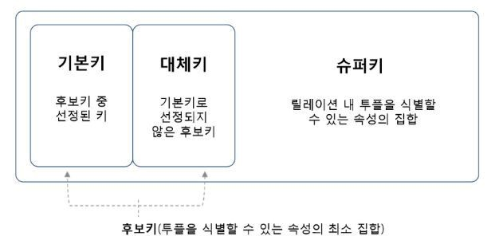
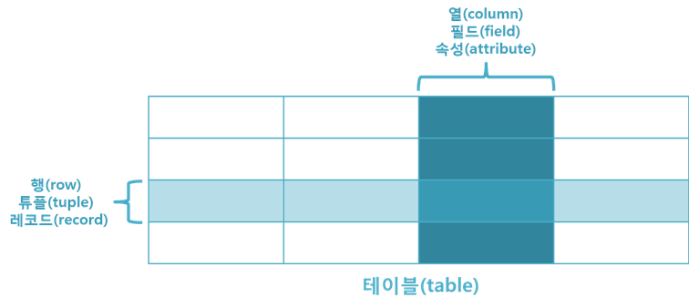
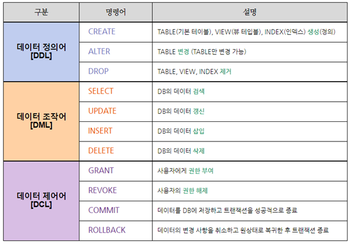

# 21.01.14

  

## 주요 질문

#### 💡 관계형 데이터베이스의 특징
 * 관계형 데이터베이스의 특징은 다음과 같습니다. 
    1. 데이터의 분류, 정렬, 탐색 속도가 빠릅니다.
    2. 오랫동안 사용된 만큼 신뢰성이 높고, 어떤 상황에서도 데이터의 무결성을 보장해 줍니다.
    3. 기존에 작성된 스키마를 수정하기가 어렵습니다.

#### 💡 [무결성 제약조건이란?](#-무결성-제약조건-종류)
 * 테이블에 부적절한 자료가 입력 되는 것을 방지하기 위해서 테이블을 생성할 때 각 컬럼에 대해서 정의하는 여러가지 규칙을 말한다. 개체, 참조, 도메인 등의 제약조건이 존재한다.

#### 💡 [키의 종류와 그에 대해 설명하시오.](#-key-종류)
 * 키(Key)는 데이터베이스에서 조건에 만족하는 튜플을 찾거나 순서대로 정렬할 때 다른 튜플들과 구별할 수 있는 유일한 기준이 되는 Attribute(속성)입니다. 기본키, 대체키, 슈퍼키, 후보키, 외래키로 구분 됩니다.
   

#### 💡 View에 대해서 설명하시오.
   * View의 의미는 하나의 select문과 같다고 생각하면 된다. 물론 뷰를 통해 insert, update, delete가 가능하지만 대개의 경우는 select를 위해 사용한다. View란 한개 이상의 기본 테이블이나 다른 뷰를 이용하여 생성 되는 가상 테이블(virtual table)이다.

   * 뷰는 기존에 생성된 테이블 또는 다른 뷰에서 접근할 수 있는 전체 데이터 중에서 일부만 접근할 수 있도록 제한하기 위한 기법이다.

         * 장점
           1. 논리적 데이터 독립성을 제공한다.
           2. 동일 데이터에 대해 동시에 여러사용자의 상이한 응용이나 요구를 지원해 준다.
           3. 사용자의 데이터관리를 간단하게 해준다.
           4. 접근 제어를 통한 자동 보안이 제공된다.

         * 단점
            1. 독립적인 인덱스를 가질 수 없다.
            2. ALTER VIEW문을 사용할 수 없다. 즉 뷰의 정의를 변경할 수 없다.
            3. 뷰로 구성된 내용에 대한 삽입, 삭제, 갱신, 연산에 제약이 따른다.

 

## 심화 질문

#### 💡 Select 쿼리 실행 순서
   * SELECT 쿼리문을 실행했을때 FROM - WHERE GROUP BY - HAVING - SELECT - ORDER BY 순서대로 실행이 됩니다.
      

#### 💡 SubQuery와 Join의 속도 차이
   
   - 서브쿼리는 SQL 내부에서 작성되는 일시적인 테이블이다. (이를 영속화 한 것이 뷰) 테이블과 서브쿼리는 기능적인 관점에서는 전혀 차이가 없으며, SQL은 이 두 가지를 같은 것으로 취급한다. 그렇지만 테이블과 뷰, 서브쿼리는 각각 다른 개념이며 다음과 같은 특징을 가진다.

     - 테이블: 영속적인 데이터를 저장
     - 뷰: 영속적이지만 데이터는 저장하지 않음. 따라서 접근할 때마다 SELECT문이 실행됨
     - 서브쿼리: 비영속적인 생존기간(스코프)이 SQL구문 실행 중으로 한정됨

   - 서브 쿼리는 기능적으로 유연하기 때문에 빈번하게 사용되지만 비기능적인 관점에서보면 테이블에 비해 성능이 떨어지는 경향이 있다. 서브 쿼리의 성능적 문제는 서브 쿼리가 데이터의 실체를 저장하지 않고 있다는 점에 기인하며, 다음과 같다.

     - 연산 비용: 매번 SELECT 문이 실행되기 때문(내용이 복잡할수록 비용이 크다)
     - 데이터 I/O 비용: 서브 쿼리의 결과 데이터 양이 크면 연산 결과를 저장소에 쓰기 때문 
     - 최적화 불가능: 서브 쿼리의 결과 집합에는 인덱스나 제약조건이 없기 때문

   - 이러한 문제점 때문에 내부적으로 복잡한 연산을 수행하거나 결과 크기가 큰 서브 쿼리를 사용할 때는 성능 리스크를 고려해야 한다. 서브 쿼리는 유연성으로 인해 코딩을 할때는 편리하나, 해당 내용이 서브 쿼리를 꼭 사용해야 하는지를 항상 고민해야 한다.

   https://m.blog.naver.com/jwyoon25/221289425535

<!-- #### 💡 Database를 사용하는 이유

* 파일처리시스템의 문제점을 해결하기 위한 목적으로 만들어졌다. 데이터베이스가 존재하기 이전에는 파일 시스템을 이용하여 데이터를 관리하였다. 데이터를 각각의 파일 단위로 저장하며 이러한 일들을 처리하기 위한 독립적인 애플리케이션과 상호 연동이 되어야 한다. 이 때의 문제점은 데이터 종속성 문제와 중복성, 데이터 무결성이다. -->
  
 

## 개념 정리

### ⭐ 무결성 제약조건 종류
  1. 개체 무결성
     * 릴레이션에서 기본키를 구성하는 속성은 널(NULL)값이나 중복값을 가질 수 없습니다.
     ex) <학생> 릴레이션에서 '학번'이 기본키로 정의되면 튜플을 추가할 때 '주민번호'나 '성명'필드에는 값을 입력하지 않아도 되지만 '학번' 속성에는 반드시 값을 입력해야 합니다. 또한 '학번' 속성에는 이미 한번 입력한 속성값을 중복하여 입력 할 수 없습니다.
     즉 NULL 값 허용 불가, 값 중복 허용 불가 입니다.

  2. 참조 무결성
     * 외래키 값은 NULL이거나 참조 릴레이션의 기본키 값과 동일해야 합니다. 즉 릴레이션은 참조할 수 없는 외래키 값을 가질 수 없습니다. 
     당연한 이야기입니다. 없는 값을 참조할 수 없으니 있는 값에서 참조하라는 말입니다.
   
      * _ex) <수강> 릴레이션 '학번' 속성에는 <학생> 릴레이션의 '학번' 속성에 없는 값은 입력할 수 없습니다._

  1. 도메인 무결성
     * 특정 속성의 값이 그 속성이 정의된 도메인에 속한 값이어야 한다는 규정입니다. 현재 대한민국 고등학교 학년은 1학년,2학년,3학년이지요? 그렇다면 학년이라는 속성값에 들어갈 수 있는 값의 범위는 무조건 1~3입니다. 이것이 바로 도메인 무결성입니다. 또 한가지 예를 들어 보겠습니다. 인간의 성별은 남, 여로 나뉩니다. 그렇다면 성별이라는 속성에 들어 갈 수 있는 값은 여자 이거나 남자 여야 합니다. 남자, 여자 이외의 값은 도메인 무결성을 위반한 것이라 할 수 있습니다. 
   
  2. 고유 무결성
      * 특정 속성에 대해 고유한 값을 가지도록 조건이 주어진 경우, 그 속성값은 모두 달라야 하는 제약조건을 말합니다.  학생 릴레이션(테이블)에서 테이블 정의시 '이름' 속성에는 중복된 값이 없도록 제한했다면, '이름' 속성에는 중복된 이름이 있어서는 안됩니다.

  3. NULL 무결성
      * 특정 속성값에 NULL 이 올 수 없다는 조건이 주어진 경우, 그 속성값은 NULL 값이 올 수 없다는 제약조건을 말합니다. 학생 릴레이션에서 릴레이션 정의 시 '학과' 속성에는 NULL 값이 올 수 없도록 제한했다면 '학과' 속성에는 NULL 이 있어서는 안됩니다.

  4. 키 무결성
      * 한 릴레이션(테이블)에는 최소한 하나의 키가 존재해야 한다는 제약조건을 뜻합니다.

 

### ⭐ Key 종류
  1. 후보키 (Candidate Key)
     * 릴레이션을 구성하는 속성들 중 튜플을 유일하게 식별할 수 있는 속성들의 부분집합을 의미합니다. 

         _ex) <학생> 릴레이션에서 '학번'이나 '주민번호'는 다른 레코드를 유일하게 구별할 수 있는 기본키로 사용할 수 있으므로 후보키가 될 수 있습니다. 즉 기본키가 될 수 있는 키들을 후보키라고 합니다._

  1. 기본키 (Primary Key)
     * 후보키 중에서 선택한 주키(Main Key)
     * 한 릴레이션에서 특정 튜플을 유일하게 구별할 수 있는 속성

         _ex) <학생> 릴레이션에는 '학번'이나 '주민번호'가 기본키가 될 수 있고, <수강> 릴레이션에는 '학번'+'과목명'으로 조합해야 기본키가 만들어 질 수 있습니다. 왜냐면 <수강> 릴레이션에서는 '학번' 속성과 '과목명' 속성은 개별적으로 기본키로 사용할 수 없습니다. 다른 튜플들과 구별되지 않기 때문이지요._

         _ex) <학생> 릴레이션에서 '학번'을 기본키로 정의되면 이미 입력된 '1001'은 다른 튜플의 '학번' 속성 값으로 입력할 수 없습니다._

  2. 대체키 (Alternate Key)
     * 후보키가 둘 이상일 때 기본키를 제외한 나머지 후보키들을 말합니다.
     * 보조키라고도 합니다.

         _ex) <학생> 릴레이션에서 '학번'을 기본키로 정의하면 '주민번호'는 대체키가 됩니다._ 

  4. 슈퍼키 (Super Key)
     * 슈퍼키는 한 릴레이션 내에 있는 속성들의 집합으로 구성된 키로서 릴레이션을 구성하는 모든 튜플 중 슈퍼키로 구성된 속성의 집합과 동일한 값은 나타내지 않습니다. 
     * 릴레이션을 구성하는 모든 튜플에 대해 유일성은 만족하지만, 최소성은 만족시키지 못합니다.

         _ex) <학생> 릴레이션에서는 '학번', '주민번호', '학번'+'주민번호', '학번'+'주민번호'+'성명' 등으로 슈퍼키를 구성할 수 있습니다. 또한 여기서 최소성을 만족시키지 못한다는 말은 '학번'+'주민번호'+'성명' 가 슈퍼기인 경우 3개의 속성 조합을 통해 다른 튜플과 구별이 가능하지만, '성명' 단독적으로 슈퍼키를 사용했을 때는 구별이 가능하지 않기 때문에 최소성을 만족시키지 못합니다. 즉 뭉쳤을 경우 유일성이 생기고, 흩어지면 몇몇 속성들은 독단적으로 유일성있는 키로 사용할 수 없습니다. 이것을 최소성을 만족하지 못한다고 합니다._

5. 외래키 (Foreign Key)
   * 관계(Relation)를 맺고 있는 릴레이션 R1, R2에서 릴레이션 R1이 참조하고 있는 릴레이션 R2의 기본키와 같은 R1 릴레이션의 속성
   * 외래키는 참조되는 릴레이션의 기본키와 대응되어 릴레이션 간에 참조 관계를 표현하는데 중요한 도구로 사용됩니다.
   * 외래키로 지정되면 참조 테이블의 기본키에 없는 값은 입력할 수 없습니다. (참조 무결성 조건)
      
      _ex) <수강> 릴레이션이 <학생> 릴레이션을 참조하고 있으므로 <학생> 릴레이션의 '학번'은 기본키이고, <수강> 릴레이션의 '학번'은 외래키입니다. 즉 각 릴레이션의 입장에서 속성은 기본키가 되기도하고, 외래키가 되기도 합니다._

      _ex) <수강> 릴레이션의 '학번'에는 <학생> 릴레이션의 '학번'에 없는 값은 입력할 수 없습니다._

 

### ⭐ RDBS 용어 정리
   
     
   1. 열(column) 
    각각의 열은 유일한 이름을 가지고 있으며, 자신만의 타입을 가지고 있습니다. 또한 열의 개수를 차수라고 표현하고, 이러한 열은 필드(field) 또는 속성(attribute)이라고도 불립니다.
       
   2. 행(row) 
   행은 관계된 데이터의 묶음을 의미합니다.
   한 테이블의 모든 행은 같은 수의 열을 가지고 있습니다.
   이러한 행은 튜플(tuple) 또는 레코드(record)라고도 불립니다.
    
   3. 값(value) 
   테이블은 각각의 행과 열에 대응하는 값을 가지고 있습니다.
   이러한 값은 열의 타입에 맞는 값이어야 합니다.
    
   4. 키(key) 
   테이블에서 행의 식별자로 이용되는 열을 키(key) 또는 기본 키(primary key)라고 합니다.
   즉, 테이블에 저장된 레코드를 고유하게 식별하는 후보 키(candidate key) 중에서 데이터베이스 설계자가 지정한 속성을 의미합니다.
    
   5. 관계(relationship) 
   테이블 간의 관계는 관계를 맺는 테이블의 수에 따라 다음과 같이 나눌 수 있습니다.
    

   6. 스키마(schema) 
   스키마는 테이블을 디자인하기 위한 청사진이라고 할 수 있습니다. 이러한 스키마는 테이블의 각 열에 대한 항목과 타입뿐만 아니라 기본 키와 외래 키도 나타내야 합니다.

   7. 도메인(domain) 
   도메인은 어트리뷰트가 취할 수 있는 모든 원자값의 범위 (표현되는 속성값의 범위)

### ⭐ 관계 대수 정리
   * 릴레이션 간의 연산으로 새로운 릴레이션을 만들어내는 과정
   원하는 정보와 그 정보를 어떻게 유도하는가를 기술하는 절차적인 방법 (절차식!)

      ##### 집합 연산자
      _____

      * 합집합 (Union)
         

       
      * 교집합 (Intersection)
         

   

      * 차집합 (Difference)
         

      * 곱집합 (Cartesian Product)
         

      * 프로젝션 (Projection)
      - 릴레이션에서 구하고자 하는 속성을 선택하여 분리해 내는 연산
         

       
      * 셀렉션 (selection) 
      - 릴레이션에서 조건에 맞는 레코드(튜플)을 분리해 내는 연산 
         

      

      ##### 조인 연산자
      ____

      * 세타 조인
      - 두 개의 릴레이션에서 조건에 맞는 속성이 들어있는 튜플을 접속[Concatenation]하여 새로운 릴레이션을 생성하는 연산
         

      * 동일 조인
      -  세타 조건식에 의한 조인 중 조건식이 같은 경우의 조인을 의미한다.
         

      * 자연 조인 (natural)
      - 두 릴레이션의 속성값 모두를 대상으로 동일 조인을 한 후 나타나는 중복 속성을 한 쪽 릴레이션에서 제거하고 나타낸 것
         

      * 세미 조인
      - 자연 조인한 결과 릴레이션을 조인에 참여한 두 릴레이션 중 하나의 속성 형태로 프로젝션하는 연산
         

      * 외부 조인 (outer)
      - 두 개의 릴레이션을 자연 조인할 때 조인할 상대 릴레이션에 대응되는 튜플이 존재하지 않는 경우 이를 배제하지 않고 널[NULL] 튜브로 만들어 결과 릴레이션에 포함시키는 조인 방식
         

      
       
      * 디비전 (Division)
      - 두 개의 릴레이션 R, K가 있을 때, K 릴레이션의 모든 조건을 만족하는 경우의 튜플들을 릴레이션 R에서 분리해 내어 프로젝션하는 연산
         

### ⭐ 관계 언어 SQL [ Structured Query Language ]
   * SQL의 특징   
      - 비절차적 언어
      - 표준 언어 { of 관계 DB }
      - 혼합 언어 { based on 관계 대수 + 관계 해석 }
      - 데이터 정의[DDL], 조작[DML], 제어[DCL] 기능을 모두 갖춘 언어
      - 대화식 질의어로 사용 가능
      - 다른 프로그램 언어(COBOL, PL/1, C, PASCAL)에 삽입된 형태로 사용 가능

   * SQL에서 사용하는 테이블의 종류
      - 기본 테이블 [ Base Table ] : CREATE by DDL, 독립적으로 존재, 테이블명을 기록해야 함.
      - 뷰 테이블 [ View Table ] : CREATE by DDL, 기본 테이블에서 유도된 가상 테이블
      - 임시 테이블 [ Temporary Table ] : Make by DML, 질의 처리 과정에서 임시적으로 만들어지는 테이블
      

  