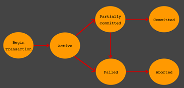
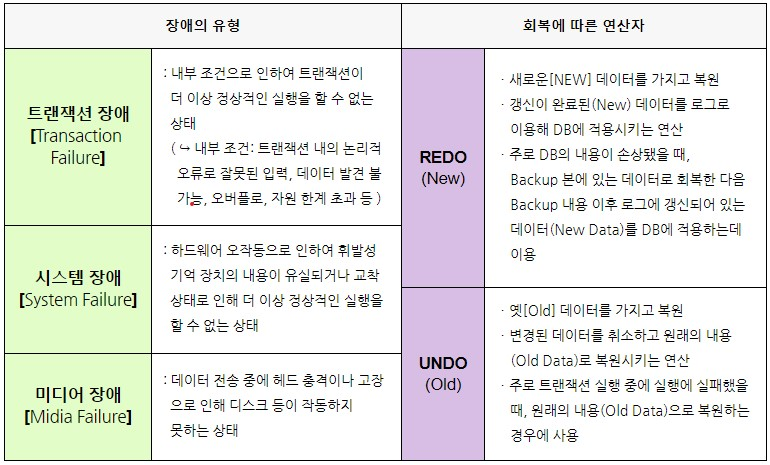

# 21.01.16

  

## 주요 질문

#### 💡 트랜잭션이란?

   * DB의 상태를 하나의 일관된 상태에서 또 다른 일관된 상태로 변환시켜주는 일련의 논리적 연산의 집합

   * 트랜잭션은 DB 서버에 여러 개의 클라이언트가 동시에 액세스 하거나 응용프로그램이 갱신을 처리하는 과정에서 중단될 수 있는 경우 등 데이터 부정합을 방지하고자 할 때 사용합니다.

#### 💡 트랜잭션 특징 

   *  트랜잭션의 특징은 크게 4가지 **(ACID)** 로 구분된다.
      - **원자성 (Atomicity)**: 트랜잭션이 데이터베이스에 모두 반영되던가, 아니면 전혀 반영되지 않아야 한다.
      - **일관성 (Consistency)**: 트랜잭션의 작업 처리 결과가 항상 일관성이 있어야 한다.
      송금 예제에서 금액의 데이터 타입이 정수형(integer)인데, 갑자기 문자열(string)이 되지 않는 것을 말합니다.
      - **독립성 (Isolation)**: 둘 이상의 트랜잭션이 동시에 실행되고 있을 경우 어떤 하나의 트랜잭션이라도, 다른 트랜잭션의 연산에 끼어들 수 없다는 점을 가리킨다.
      - **지속성 (Durability)**: 트랜잭션이 성공적으로 완료됬을 경우, 결과는 영구적으로 반영되어야 한다

  
#### 💡 잠금(Locking) 기법이란?

   *	잠금(Locking)은 하나의 트랜잭션이 실행하는 동안 특정 데이터 항목에 대해서 다른 트랜잭션이 동시에 접근하지 못하도록 상호배제(Mutual Exclusive) 기능을 제공하는 기법이다. 하나의 트랜잭션이 데이터 항목에 대하여 잠금(lock)을 설정하면, 잠금을 설정한 트랜잭션이 해제(unlock)할 때까지 데이터를 독점적으로 사용할 수 있다.
  
#### 💡 교착상태(deadlock) 이란?
   * 교착 상태(Dead Lock)란 여러 개의 트랜잭션(Transaction)들이 실행을 하지 못하고 서로 무한정 기다리는 상태를 의미합니다. 
   * 기본적으로 데이터베이스에서는 트랜잭션들의 '동시성'을 제어하기 위한 기법으로 로킹(Locking)을 사용합니다. 이러한 로킹이 데이터가 엉망진창이 되는 것을 막아주겠지만 반면에 그 부작용으로 교착 상태를 일으킬 수 있다.

 

## 심화 질문

#### 💡 교착상태(deadlock) 해결 방법

   - 예방 기법 : 예방 기법은 각 트랜잭션이 실행되기 전에 필요한 데이터를 모두 로킹(Locking) 해주는 것입니다. 다만 예방 기법은 데이터가 많이 필요하면 사실상 모든 데이터를 전부 로킹 해주어야 하므로 트랜잭션의 병행성을 보장하지 못합니다. 뿐만 아니라 몇몇 트랜잭션은 계속해서 처리를 못 하게 되는 기아 상태가 발생할 수 있습니다.
   - 회피 기법 : 회피 기법은 자원을 할당할 때 시간 스탬프(Time Stamp)를 사용하여 교착상태가 일어나지 않도록 회피하는 방법입니다. 이러한 회피 기법으로는 Wait-Die 방식과 Wound-Wait 방식이 있습니다.
      

 

## 개념 정리

### ⭐ 트랜잭션 상태
   
   - Active : 트랜잭션의 활동 상태. 트랜잭션이 실행중이며 동작중인 상태를 말한다.
   - Failed : 트랜잭션 실패 상태. 트랜잭션이 더이상 정상적으로 진행 할 수 없는 상태를 말한다.
  - Partially Committed : 트랜잭션의 Commit 명령이 도착한 상태. 트랜잭션의 commit이전 sql문이 수행되고 commit만 남은 상태를 말한다.
  - Committed : 트랜잭션 완료 상태. 트랜잭션이 정상적으로 완료된 상태를 말한다.
  - Aborted : 트랜잭션이 취소 상태. 트랜잭션이 취소되고 트랜잭션 실행 이전 데이터로 돌아간 상태를 말한다. 
   

    

  - Partially Committed 와 Committed 의 차이점 
      : Commit 요청이 들어오면 상태는 Partial Commited 상태가 된다. 이후 Commit을 문제없이 수행할 수 있으면 Committed 상태로 전이되고, 만약 오류가 발생하면 Failed 상태가 된다. 즉, Partial Commited는 Commit 요청이 들어왔을때를 말하며, Commited는 Commit을 정상적으로 완료한 상태를 말한다.

   

      
출처

   [https://victorydntmd.tistory.com/](https://victorydntmd.tistory.com/129) 
   [https://medium.com/pocs/](https://medium.com/pocs/%EB%8F%99%EC%8B%9C%EC%84%B1-%EC%A0%9C%EC%96%B4-%EA%B8%B0%EB%B2%95-%EC%9E%A0%EA%B8%88-locking-%EA%B8%B0%EB%B2%95-319bd0e6a68a)

   

  
 

### ⭐ DB 회복(Recovery)
   * 어떤 외부적 혹은 내부적 장애 요인으로 DB의 상태가 일관성을 유지할 수 없을 때, 장애 이전의 일관된 상태가 되도록 복원하는 일
   

   

      
출처

      <!--summary 아래 빈칸 공백 두고 내용을 적는공간-->
      https://github.com/gyoogle/tech-interview-for-developer/blob/master/Computer%20Science/Database/Transaction%20Isolation%20Level.md
   

  
 
