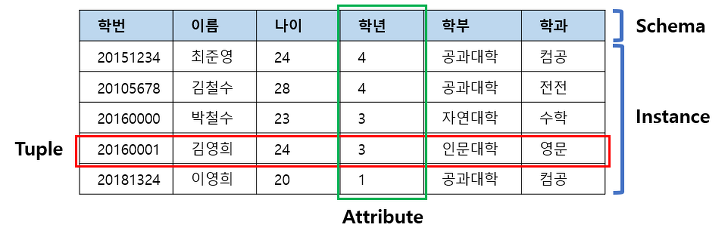

# 21.01.24
* 데이터베이스 개념
* ACID
* Key
* JOIN
* Injection
* DB 풀
<br/><br/>

## 주요 질문
#### 💡 데이터베이스를 사용하는 이유?
* 데이터베이스가 존재하기 전에는 파일 시스템을 이용해서 데이터를 관리했습니다. 데이터를 각각의 파일로 저장해서 처리하면 데이터의 종속성, 중복성, 무결성 문제가 발생할 수 있습니다.  그래서 데이터베이스를 사용합니다.

  
#### 💡 [JOIN에 대해서 설명해주세요.](#Join)
   * Join은 2개 테이블의 연관된 튜플들을 결합하여 하나의 새로운 릴레이션을 반환하는 개념입니다.
   * Join은 크게 Inner Join과 Outer Join으로 구분됩니다.  Inner Join은 두 릴레이션에서 관련있는 튜플만 표시하고, Outer Join은 Join조건에 만족하지 않는 튜플도 결과로 출력합니다.

   


<br/><br/>


<br/><br/>

## ⭐ 개념 정리
### 데이터베이스의 특징

* 물리적 독립성
   * 데이터베이스의 데이터를 새롭게 추가하더라도 관련된 응용 프로그램을 수정할 필요가 없다.
* 논리적 독립성
   * 데이터베이스는 논리적인 구조로 다양항 응용 프로그램의 논리적 요구를 만족시켜줄 수 있다.
* 데이터의 무결성
   * 여러 경로를 통해 잘못된 데이터가 발생하는 것을 방지한다.
* 데이터의 보안성
   * 인가된 사용자들만 데이터베이스와 자원에 접근할 수 있다. 
* 데이터의 일관성
   * 연관된 정보를 논리적인 구조로 관리해서 특정 데이터만 변경했을 경우 발생할 수 있는 데이터의 불일치성을 배제할 수 있다.
* 데이터 중복 최소화 
   * 데이터를 통합해서 관리함으로써 파일 시스템의 단점인 자료와 데이터의 중복성 문제를 해결할 수 있다.


   
   
<br/>

### RDBMS 구조



### 키(Key)
* Key란? : 검색, 정렬시 Tuple을 구분할 수 있는 기준이 되는 Attribute.


1. 후보키: Candidate Key
   * Tuple을 유일하게 식별하기 위해 사용하는 속성들의 부분 집합이다. 기본키로 사용할 수 있다.

   * 2가지 조건 만족해야 한다.

      * 유일성 : 하나의 Key로 하나의 Tuple을 유일하게 식별할 수 있어야 한다.
      * 최소성 : 꼭 필요한 속성으로만 구성되어야 한다.

2. 기본키: Primary Key
   * 후보키 중에서 선택한 Main Key로 중복된 값을 가질 수 없다.

   * 특징
      * 후보키의 성질을 가진다.(유일성, 최소성)
      * 특정 튜플을 유일하게 구별할 수 있는 속성이다.

3. 대체키: Alternate Key
   * 후보키 중 기본키를 제외한 나머지 Key를 말한다. = 보조키


4. 슈퍼키: Super Key
   * 한 릴레이션 내에 있는 속성들의 집합이다.
   * 유일성은 만족하지만, 최소성은 만족하지 않는다.
### Join

* 조인이란?
   * 두 개 이상의 테이블이나 데이터베이스를 연결하여 데이터를 검색하는 방법이다.
   테이블을 연결하려면, 적어도 하나의 Attribute를 서로 공유하고 있어야 한다.


* JOIN 종류
   * INNER JOIN
   * LEFT OUTER JOIN
   * RIGHT OUTER JOIN
   * FULL OUTER JOIN
   * CROSS JOIN
   * SELF JOIN


* INNER JOIN

   * 교집합으로, 기준 테이블과 join 테이블의 중복된 값을 보여준다.
   ```sql
   SELECT
   A.NAME, B.AGE
   FROM EX_TABLE A
   INNER JOIN JOIN_TABLE B ON A.NO_EMP = B.NO_EMP
   ```
* LEFT OUTER JOIN

   * Inner join 결과를 구한 후, 우측 릴레이션의 어떤 튜플과도 맞지 않는 좌측 릴레이션의 튜플들에 NULL값을 붙인다.
   ```sql
   SELECT
   A.NAME, B.AGE
   FROM EX_TABLE A
   LEFT OUTER JOIN JOIN_TABLE B ON A.NO_EMP = B.NO_EMP
   ```
* RIGHT OUTER JOIN

   * LEFT OUTER JOIN과는 반대로 우측 릴레이션의 튜플에 NULL을 붙인다.
   ```sql
   SELECT
   A.NAME, B.AGE
   FROM EX_TABLE A
   RIGHT OUTER JOIN JOIN_TABLE B ON A.NO_EMP = B.NO_EMP
   ```
* FULL OUTER JOIN

   * Left outer join + Right outer join 이다.
   * Inner join의 결과를 구한 후 우측 항의 릴레이션에 NULL값을 추가한다.  그 후 좌측 항의 릴레이션에 NULL값을 추가한다.
   ```sql
   SELECT
   A.NAME, B.AGE
   FROM EX_TABLE A
   FULL OUTER JOIN JOIN_TABLE B ON A.NO_EMP = B.NO_EMP
   ```
* CROSS JOIN

   * 조인 테이블에 있는 튜플들의 순서쌍을 반환한다.

   * 결과 행의 수: A 테이블, B 테이블의 행 수를 곱한 것과 같다.

   ```sql
   SELECT
   A.NAME, B.AGE
   FROM EX_TABLE A
   CROSS JOIN JOIN_TABLE B
   ```
* SELF JOIN

   * 같은 테이블에서 2개의 속성을 연결하여 EQUI JOIN하는 것이다.
   * 자기자신과 자기자신을 조인하는 것이다.

   ```sql
   SELECT
   A.NAME, B.AGE
   FROM EX_TABLE A, EX_TABLE B
   ```


<br/>
[출처]