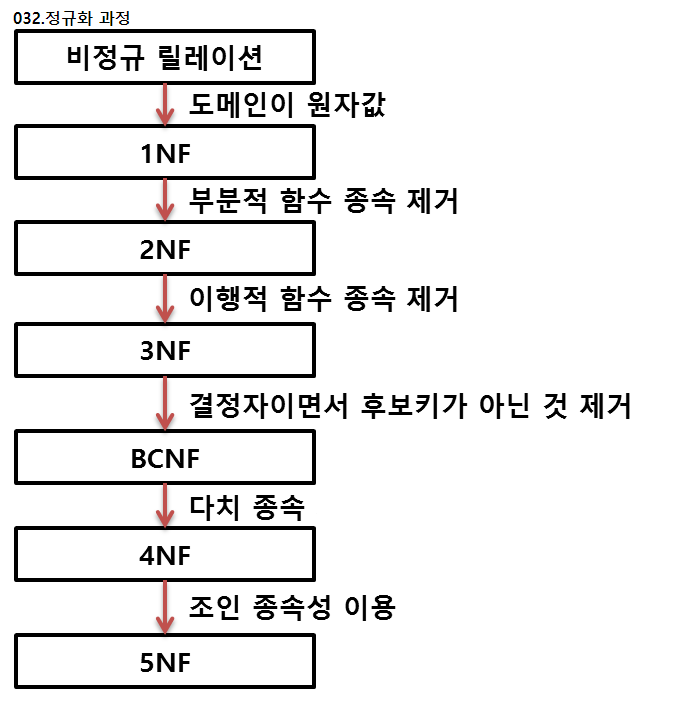

# 21.00.00
* 정규화

## 주요 질문

#### 💡 [정규화에 대해서 설명해주세요.](#정규화)

* 정규화는 종속적으로 설계된 관계형 스키마가 하나의 릴레이션에 표현될 수 있도록 분해하는 과정입니다.
* 데이터의 중복성을 최소화하고 일관성을 보장하기 위한 과정입니다.
* 정규화를 거치지 않으면 [이상(Anormaly)](#이상(Anormaly)) 문제가 발생합니다.

 

## 심화 질문

#### 💡 정규화의 장단점은 무엇인가요?
* 장점
   * 데이터베이스 변경 시 이상 현상(Anomaly) 문제점을 해결할 수 있습니다.
   * 새로운 데이터 형의 추가로 인한 확장 시, 구조를 최소한으로 변경할 수 있습니다.
* 단점
   * 릴레이션의 분해로 인해 릴레이션 간 Join연산이 많아집니다.
   * 따라서 질의 응답시간이 느려질 수 있습니다.  이러한 경우 반정규화를 적용해볼 수 있습니다.

   
#### 💡 반정규화란?
   * 정규화된 데이터 모델을 통합, 중복, 분리하는 과정입니다.
   * 의도적으로 정규화 원칙을 위배하는 방법입니다.
   * 사용예시
      * 조인 많을 때: 테이블 통합
      * 레코드별 사용빈도 차이가 클 때: 테이블 수평분할
      * 테이블에 속성이 많을 때: 테이블 수직분할
      * 특정 데이터 자주 처리할 때: 중복 테이블 추가
      * 접근 경로가 복잡할 때: 중복속성 추가
   * 주의할 점
      * 데이터의 일관성이 떨어질 수 있습니다.
   출처 https://github.com/JaeYeopHan/Interview_Question_for_Beginner/tree/master/Database#transaction

 

## ⭐ 개념 정리

### 이상(Anormaly)
   * 정규화를 거치지 않아 데이터가 불필요하게 중복되어 생기는 예기치 않은 문제
   * 종류
      * 삽입 이상: 릴레이션에 데이터를 삽입할 때 원하지 않은 값들도 함께 삽입되는 현상
      * 삭제 이상: 릴레이션에서 튜플을 삭제할 때 다른 값들도 함께 삭제되는 현상 
      * 갱신 이상: 릴레이션에서 튜플의 속성값을 갱신할 때 일부 튜플만 갱신되는 현상
   
   

 

### 정규화
* 
* 1NF - 제 1정규형
   * 릴레이션에 속한 모든 도메인(속성값)이 더이상 쪼갤 수 없는 원자값이어야 한다.
* 2NF - 제 2정규형
   * 기본키에 대해 다른 모든 속성이 [완전 함수적 종속](#완전-함수적-종속)을 만족해야 한다.
* 3NF - 제 3정규형
   * 무손실조인 또는 종속성 보존을 저해하지 않고 항상 3NF를 얻을 수 있어야 한다.
* BCNF - Boyce - Codd 정규형
   * [결정자](#결정자)가 모두 후보키여야 한다.
   * 후보키가 서로 중첩되는 경우에 적용한다.
* 4NF - 제 4정규형
   * 릴레이션에 [다치종속](#다치종속)이 성립하는 경우(A->->B), 릴레이션의 모든 속성이 A에 [함수적 종속 관계](#함수적-종속-관계)를 만족해야 한다.
* 5NF - 제 5정규형
   * 릴레이션 R의 모든 조인종속이 R의 후보키를 통해서만 성립되어야 한다.

### 함수적 종속 관계
* 수강(<u>학번, 과목명</u>, 이름, )
* 학번이 정해지면 과목명 상관없이 이름이 대응되는 경우
* 이름을 학번에 함수 종속적이라고 한다.
* 학번 -> 이름 과 같이 표기

### 완전 함수적 종속
* 수강(<u>학번, 과목명</u>, 이름, 성적)
* 어떤 속성이 기본키에 대해 완전히 종속적 
* 성적은 학번+과목명에 의해서만 결정됨
### 부분 함수적 종속
* 수강(<u>학번, 과목명</u>, 이름, 성적, 학년)
* 기본키의 일부인 학번에 의해 학년이 결정됨
* 학년은 부분 함수적 종속
### 결정자
* 수강(<u>학번, 과목명</u>, 이름, 성적)
* 학번에 의해 이름이 결정된다고 하자.
* 학번: 결정자
* 이름: 종속자
### 다치종속
* R(A,B,C)에서 (A,C)에 대응하는 B의 집합이 A에만 종속되고 C에는 무관할 때
* B는 A의 다치종속
* A ->-> B 로 표기

 
[출처]