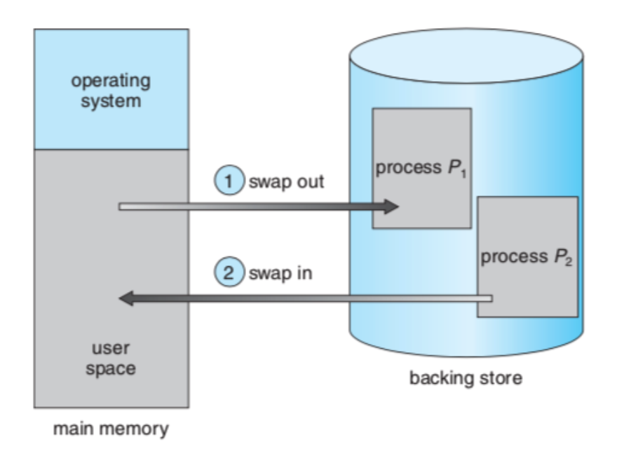

# 21.02.17

## 주요 질문

#### 💡
## 심화 질문

#### 💡 
 

## 개념 정리

### ⭐ 메모리 관리 전략
- 메모리 용량이 증가함에 따라 프로그램의 크기 또한 계속 증가하고 있기 때문에 메모리는 언제나 부족
- 제한된 물리 메모리의 효율적인 사용과 메모리 참조 방식을 제공하기 위한 전략

#### 논리 대 물리주소 공간
* CPU가 생성하는 주소를 논리 주소, 메모리가 취급하는 주소를 물리 주소라 한다. 프로그램 실행 중에는 이와 같은 가상 주소를 물리 주소로 바꿔줘야 하는데, 이 매핑 작업은 메모리 관리기(Memory Management Unit)에서 실행된다.

#### 관리 전략
* Swapping(스와핑)
  * 프로세스가 실행되기 위해서는 메모리에 있어야 하지만, 프로세스는 실행 중에 임시로 예비저장장치(backup store)에 내보내여 졌다가 실행을 계속하기 위해 다시 메모리로 돌아올 수 있다.
  
  * 프로세스를 불러들이기 위한 공간이 메모리에 부족하다면 현재 메모리에 적재된 프로세스들을 내보내고(swap out) 원하는 프로세스를 불러들인다(swap in)
  * 상당한 Context-switching time이 발생한다. 또한 스와핑을 위해서는 현재 메모리의 프로세스가 완전히 휴지상태(idle)임을 확인해야 한다.

#### Fragmentation(단편화)
  * 메모리 단편화란 메모리 공간이 비효율적으로 사용되어 저장 공간이 낭비되는 것을 말한다.
  #### 내부 단편화
   
  * 할당한 영역 중 사용되지 않는 공간으로 인해 공간이 낭비되는 것을 의미한다.
  * '내부'라는 용어는 할당한 영역 내부에 사용되지 않는 공간이 있다는 것을 뜻한다.
    * ex) 페이징 기법에서 한 페이지를 크게 할 경우 내부 단편화가 발생할 수 있다.
    * ex) 배열을 너무 크게 잡은 경우

  #### 외부 단편화
  * 메모리 여유 공간이 띄엄 띄엄 존재해서 실제로 사용할 수 없는 경우를 의미한다.
  * '외부'라는 용어는 사용할 수 없는 기억 장소가 할당된 영역 밖에 있다는 것을 뜻한다.
    * ex) 동적 메모리 할당 해제를 자주 하는 경우
  * 
  * 
  * 메모리 단편화로 일어날 수 있는 현상
    1. 총 메모리 공간은 충분 하지만 실제 사용이 불가능할 수 있다.
    2. 실제 사용 가능한 공간이 줄어들어 시스템 성능의 저하를 일으킬 수 있다.
    3. 실제 사용할 수 있는 공간을 찾는 과정이 필요
    4. 잦은 페이지 교체

#### 메모리 단편화 해결 기법
* 페이징/세그멘테이션
  * 세그멘테이션(segmentation) : 내부 단편화 해결, 외부 단편화 존재
  * 페이징(paing) : 외부 단편화 해결, 내부 단편화 존재
  
* Segmentation(세그멘테이션)이란?
  * 메모리를 서로 크기가 다른 논리적인 블록 단위인 '세그먼트(segment)'로 분할하고 메모리를 할당하여 물리 주소를 논리 주소로 변환하는 것을 말한다. 미리 분할하는 것이 아니고 메모리를 사용할 시점에 할당된다. 
  
* Paging(페이징)이란?
  * 하나의 프로세스가 사용하는 메모리 공간이 연속적이어야 한다는 제약을 없애는 메모리 관리 방법이다. 외부 단편화와 압축 작업을 해소 하기 위해 생긴 방법론으로, 물리 메모리는 Frame 이라는 고정 크기로 분리되어 있고, 논리 메모리(프로세스가 점유하는)는 페이지라 불리는 고정 크기의 블록으로 분리된다.(페이지 교체 알고리즘에 들어가는 페이지)
   

> https://m.blog.naver.com/s2kiess/220149980093