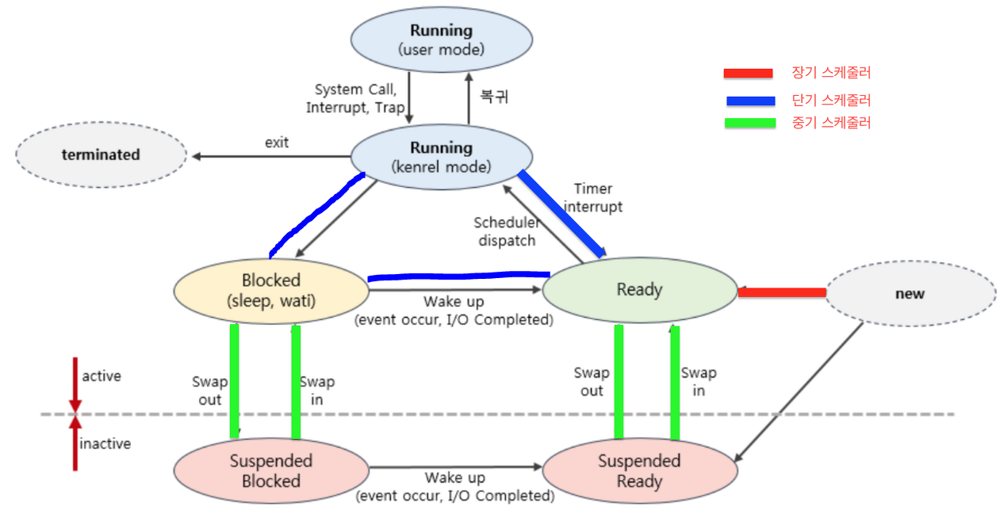

# 21.02.16
* 스케줄러 (장기,중기,단기)
* CPU 스케줄러 (FCFS, SJF, SRT, Priority Scheduling, RR)

## 주요 질문

#### 💡 스케줄러란?
   * 어떤 프로세스에게 자원을 할당할지 결정하는 운영체제의 커널 모듈입니다. 
   
   
#### 💡 장기 스케줄러
   * 작업 스케줄러라고도 부르며 어떤 프로세스를 Ready 단계에 넣을지 결정합니다. 디스크에서 어떤 프로그램을 가져와 커널(Ready Queue)에 등록할지 결정합니다. 
   * 현대의 운영체제에서는 장기 스케줄러 없이 바로 프로세스에 메모리를 할당해 Ready Queue 에 넣습니다.
   
#### 💡 중기 스케줄러
   * 메모리에 적재된 프로세스의 수를 관리합니다.
   * 메모리에 많은 수의 프로세스가 적재되면 프로세스 당 보유하는 메모리 양이 적어집니다. 그러면 CPU 수행이 필요한 프로세스의 주소도 메모리에 올려놓지 못하게 되어 성능이 저하됩니다.
   * 이 경우 SWAP OUT 작업을 통해 Ready상태에서 Suspended Ready상태로, Blocked 상태에서 Suspended Blocked 상태로 프로세스들을 옮깁니다.
      * 중지준비: suspended ready: 준비->디스크
      * 봉쇄준비: suspended block: 봉쇄->디스크

#### 💡 단기 스케줄러
   * 어떤 프로세스를 다음번에 실행(Running) 상태로 만들 것인지 결정합니다.
   * 단기 스케줄러는 미리 정한 스케줄링 알고리즘에 따라 CPU를 할당할 프로세스를 선택합니다.

#### 💡 CPU 스케줄링 알고리즘
* Ready Queue 에 있는 프로세스들 중 어떤 프로세스를 CPU에 할당할 것인지 정하는 알고리즘입니다.
* 이 알고리즘에는 선점 알고리즘과 비선점 알고리즘이 있습니다.
* 선점 알고리즘은 우선순위가 높은 작업이 진행중인 작업을 중단시키고 CPU를 사용할 수 있는 알고리즘입니다. 
* 비선점 알고리즘은 CPU를 할당받은 작업이 끝날때까지 다른 작업이 CPU 를 사용할 수 없는 알고리즘입니다.
 

#### 💡 CPU 스케줄링은 언제 발생하는가?

실행상태에서 대기상태로 전환될 때 (예, 입출력 요청) - Non preemptive(비선점)
실행상태에서 준비상태로 전환될 때 (예, 인터럽트 발생) - preemptive(선점)
대기상태에서 준비상태로 전환될 때(예, 입출력이 종료될 때)
종료될 때(Terminated)

## 심화 질문

### 비선점형
#### 💡 FCFS(First Come First Served)
   * 먼저 들어온 프로세스가 CPU 를 먼저 할당받습니다.
   * 짧은 시간이 걸리는 프로세스가 CPU 를 오래 기다릴 수 있어 비효율적입니다.
   
#### 💡 SJF(Shortest Job First)

   * 짧은 시간이 걸리는 프로세스가 CPU를 우선으로 할당하는 방법입니다.
   * 최소 평균 대기시간을 보장하지만 기아 현상이 발생할 수 있습니다.

### 선점형
#### 💡 SRT(Shortest Remaining Time)
   * 짧은 시간이 걸리는 프로세스가 CPU를 우선으로 할당받는 방식입니다.  이 때, 프로세스의 남은 CPU사용시간(burst time) 보다 짧은 process 가 도착하면 cpu 를 선점합니다.
   * 단점: CPU 사용 시간을 정확하게 예측하기 어렵습니다.
#### 💡 Priority Scheduling
   * 높은 우선순위를 가진 프로세스에게 CPU를 할당합니다.
   * 단점: 기아현상, 무한정지 상태가 발생할 수 있습니다.
#### 💡 RR(Round Robin)
   * 프로세스의 할당시간이 지나면 다른 프로세스에게 CPU를 선점당하고 Ready queue 의 맨 뒤로 가는 방식입니다. 
   * 어떤 프로세스도 할당 시간 이상 기다리지 않는 공정한 알고리즘입니다.
   * 평균 대기시간은 길어질 수 있지만, 응답시간은 짧아집니다.
   * 단점
      * 할당시간이 크면 FCFS와 같아집니다.
      * 할당시간이 작으면 문맥교환이 많이 발생해 오버헤드가 증가합니다.
 > https://velog.io/@ss-won/OS-CPU-Scheduling-Algorithm
 

## ⭐ 개념 정리

### 알고리즘에 대한 성능평가 기준 5가지
* 프로세서 이용률(CPU Utilization)  
   * 시간당 CPU를 사용한 시간의 비율
   
* 처리율(Throughput)
   * 시간당 처리한 작업의 비율

* 반환시간 또는 소요시간(Turnaround Time)
   * CPU burst time(쓰고 나갈때까지의 시간, 누적되지 않음)
   * 작업 제출 후 완료되는 순간까지의 소요시간
* 대기시간(Waiting Time)
   * 대기열에 들어와 CPU를 할당받기까지 기다린 시간

* 반응시간 또는 응답시간(Response Time)
   * 대기열에서 처음으로 CPU를 얻을때까지 걸린시간

###  주체별 CPU 성능 척도
* 시스템 입장
👉🏻 CPU Utilization + Throughput

* 사용자 입장
👉🏻 Turnaround Time + Waiting Time + Response Time
   

 
