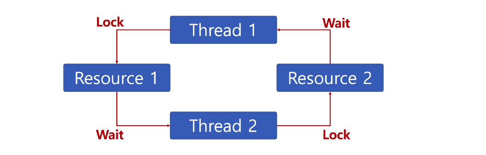
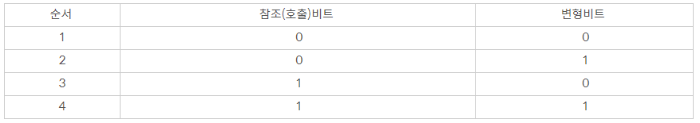

# 21.02.17
* 교착상태 vs 기아상태
* 메모리 관리전략
   * 메모리 관리 배경
   * Paging
   * Segmentation

## 질문

#### 💡 [교착상태 vs 기아상태](#교착상태)
   * 교착상태는 각 프로세스가 다른 프로세스에 의해 획득된 리소스를 기다릴 때 발생합니다.

  
   * 기아상태는 우선순위가 높은 프로세스가 우선순위가 낮은 프로세스가 실행되는 것을 계속 막는 상태입니다. 
####  💡 교착상태
 발생조건
* 다음 네 가지 조건이 모두 성립할 때 교착상태 발생 가능성 있음.
  * 상호배제(Mutual exclusion) : 프로세스들이 필요로 하는 자원에 대해 배타적인 통제권을 요구한다.
  * 점유대기(Hold and wait) : 프로세스가 할당된 자원을 가진 상태에서 다른 자원을 기다린다.
  * 비선점(No preemption) : 프로세스가 어떤 자원의 사용을 끝낼 때까지 그 자원을 뺏을 수 없다.
  * 순환대기(Circular wait) : 각 프로세스는 순환적으로 다음 프로세스가 요구하는 자원을 가지고 있다.
   
해결방안
 * 위 4가지 발생조건 중 1개라도 성립되지 않으면 된다.  

####  💡 기아상태
* 해결방안
   * 오래 기다린 프로세스의 우선순위 높이기
   * 우선순위가 아닌 요청 순서대로 처리하는 큐 사용하기 

####  💡 운영 체제에서 기아(Starvation) 란 무엇입니까?
특정 프로세스의 우선순위가 낮아서 원하는 자원을 계속 할당 받지 못하는 상태이다.

기아상태는 자원 관리 문제이다. 이 문제에서 대기중인 프로세스는 리소스가 다른 프로세스에 할당되어 있기 때문에 오랫동안 필요한 리소스를 얻지 못한다.

 

####  💡 운영 체제에서 에이징(Aging)는 무엇입니까?
에이징은 자원 스케줄링 시스템에서 기아를 방지하기 위해 사용되는 기술이다. 특정 프로세스의 우선순위가 낮아 무한정 기다리게되는 경우, 한번 양보하거나 기다린 시간에 비례하여 일정 시간이 지나면 우선순위를 한 단계씩 높여 가까운 시간 안에 자원을 할당받도록 하는 기법을 말한다.

#### 💡 메모리 관리전략이란?
   * 제한된 메모리를 효율적으로 사용하기 위한 전략입니다.  
   효율적인 메모리 사용을 위해서 [반입전략](#반입전략), [배치전략](#배치전략), 교체전략이 있습니다.

#### 💡 교체전략: Replacement

   * 주기억장치의 영역이 모두 사용중일 때, 사용중인 영역중 어느 영역이랑 교체해서 사용할 것인지 결정하는 전략입니다.
   * 종류에는 FIFO, OPT, LRU, LFU, NUR, SCR 등이 있습니다.

#### 💡 가상기억장치
* 보조기억장치의 일부를 주기억장치처럼 사용하는 장치입니다.
* 주기억장치의 용량보다 큰 프로그램을 실행하기 위해 사용합니다.
* 가상기억장치의 구현 방법에는 페이징 기법과 세그먼테이션 기법이 있습니다.

#### 💡 페이징 기법
* 영역을 동일한 크기로 나눈 후 크기가 동일한 페이지를 영역에 적재시켜 실행하는 기법입니다.
* 페이지: 일정한 크기로 나눈 단위.
* 내부 단편화 발생 가능

단편화: 빈 기억공간
#### 💡  페이징의 장점과 단점은?

장점: 메모리를 페이지단위로 가져와서, 프로세스의 효율적인 운영이 가능하다.

단점: 페이지 크기별, 단위별로 페이지 폴트 현상이 발생할 수 있다.
#### 💡 세그멘테이션 기법
* 가상 기억장치의 프로그램을 다양한 크기로 나눈 후 주기억장치에 적재시켜 실행하는 방법입니다.
* 세그먼터: 다양한 크기로 나눈 단위
* 외부 단편화 발생 가능
#### 💡 페이지 교체 알고리즘
* FIFO(first in first out)
   * 메모리에 올라온지 가장 오래된 페이지 교체
* 최적(Optimal) 페이지 교체
   * 앞으로 가장 오랫동안 사용되지 않을 페이지 교체
* LRU(Least Recently Used)
   * 최근에 가장 오랫동안 사용하지 않은 페이지 교체
* LFU(Least Frequently Used)
   * 사용 빈도가 가장 적은 페이지 교체
* NUR(Not Used Recently)
   * 최근에 사용하지 않은 페이지 교체
   * 변형비트, 참조비트 사용
      * 변형비트: 변경시 1, 아니면 0
      * 참조비트: 호출시 1, 아니면 0

   

* SCR(Second Chance Replacement, 2차 기회 교체)
   * 가장 오랫동안 주기억장치에 있던 페이지 중 자주 사용되는 페이지 교체 방지
   * FIFO 단점 보완

#### 💡 메모리 단편화 란 무엇인가?

메모리의 빈 공간 또는 자료가 여러 개의 조각으로 나뉘는 현상을 말한다. 할당한 메모리를 해제를 하게 되면 그 메모리 공간이 빈 공간(사용하지 않는 공간)이 되고 그 빈공간의 크기보다 큰 메모리는 사용할 수 없다. 그리하여 이 공간들이 하나 둘 쌓이게 되면 수치상으로는 많은 메모리 공간이 남았음에도 불구하고, 실제로 사용할 수 없는 메모리가 발생한다.

 

 

#### 💡 내부단편화와 내부단편화란?

- 내부단편화

: 분할된 영역이 할당된 프로그램의 크기보다 커서 사용되지 않고 남아 있는 빈 공간을 말한다.

: 내부 단편화는 페이징에서 발생한다.

 

- 외부단편화

: 분할된 영역이 할당될 프로그램의 크기보다 작아서 모두 빈 공간으로 남아 있는 전체 영역을 말한다.

: 외부 단편화는 세그먼테이션에서 발생한다.

 

 

#### 💡 메모리 단편화 해결방법은?

메모리 압축(디스크 조각 모음), 메모리 통합(단편화가 발생된 공간들을 하나로 통합시켜 큰 공간으로 만드는 기법)

 

 

## ⭐ 개념 정리

### 반입전략
   * Fetch 
   * 보조 기억장치에 보관중인 데이터를 언제 주기억장치로 옮길 것인지
   * 요구반입: 요구할때 옮긴다.
   * 예상반입: 사용될 것을 미리 예상해서 옮긴다.

### 배치전략
   * Placement
   * 새로 반입되는 데이터를 주기억장치의 어느 위치에 놓을것인지
   * 최초 적합: FirstFit: 프로그램이나 데이터가 들어갈 수 있는 크기의 빈 영역 중 첫번째 영역에 배치
   * 최적 적합 BestFit : 단편화를 가장 작게 남기는 영역에 배치
   * 최악적합: WorstFit : 단편화를 가장 많이 남기는 분할영역에 배치

