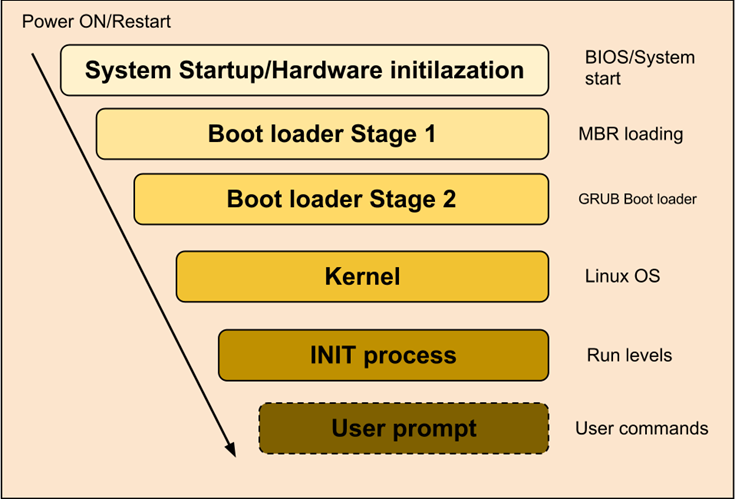
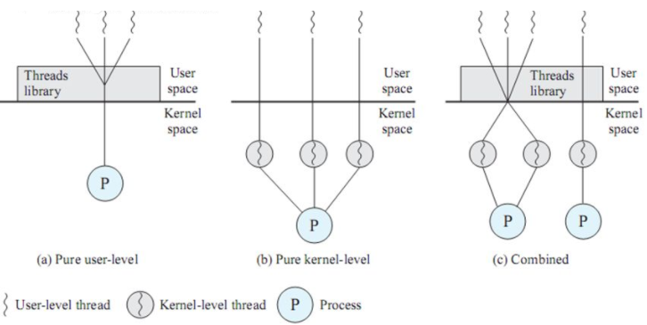

# 21.02.23
* 리눅스 부팅 과정
* CISC vs RISC 
* 사용자 스레드 vs 커널 스레드

## 주요 질문

 

## 심화 질문

 

## ⭐ 개념 정리

## 리눅스 부팅 과정

   

* 0 단계 : 시스템 전원 공급
   * 메인보드의 BIOS 프로그램을 실행한다.
   * BIOS 프로그램은 메모리에 로드되고 CPU는 BIOS 프로그램을 자동실행한다.
* 1 단계 : BIOS(Basic Input/Output System) 단계(Firmware 단계)
   * 부트매체 검색과 부트로더가 실행된다.
   * 자체진단과정(Power On Self Test) 가 이상없이 완료되면 부팅매체에서 부트로더를 불러들인다.
      * 자체진단과정: CPU, 메모리, 키보드 등 장치 검사 및 하드웨어 초기화
   * 부트로더가 메모리에 적재되면 BIOS 는 종료된다. -> 시스템 제어권은 부트로더가 갖는다. 
* 2 단계 : 부트 로드(Boot Loader) 단계
   * 부트로더는 커널 이미지를 불러들이고 시스템 제어권을 커널로 넘긴다.
      * 부트로더: GRUB(GRand Unified Bootloader)
* 3 단계 : 커널(Kernel) 단계
   * 커널이 메모리에서 실행되면 하드웨어를 점검하고 /var/log/dmesg 파일에 기록한다.
   * 루트 파일을 읽기전용으로 마운트한다. 
   * 커널은 PID0 번을 호출한다.
   * PID0 번은 커널이 사용할 장치를 초기화하고 PID1번을 실행한다.
   * PID1번 init 프로세스가 실행되면서 /etc/inittab 파일의 내용을 실행한다.
* 4 단계 : Init 단계
   * /etc/inittab 파일에 따라 시스템을 초기화한다.

  
 

  

## CISC vs RISC 
### CISC
* Complex Instruction Set Computer
* 복잡한 명령어 집합을 갖는 CPU 아키텍처

#### CISC의 특징

* 명령어의 개수가 많음
* 명령어 길이가 다양하며, 실행 사이클도 명령어 마다 다름
* 회로구성이 복잡함
* 프로그램을 만들 때 적은 명령어로 구현 가능
* 다양한 명령어를 사용하기 때문에 컴파일러가 복잡함

#### CISC를 사용하는 이유

* 아직 많은 프로세서가 CISC 모델로 구축되어 있다. 이것을 전부 바꾸는 것은 큰 비용이 든다.
* CISC 성능의 취약점은 RISC와 같은 파이프라인을 일부 사용하고 집적도는 더 높임으로써 부분적으로 보완이 가능하다.
* RISC에 비해 호환성이 좋다.

### RISC
* Reduced Instruction Set Computer
* CPU 명령어의 개수를 줄여 하드웨어 구조를 간단하게 만든 방식
* 마이크로 프로세서 설계방법중 하나

#### RISC의 특징
* 적은 명령어 세트
   * CISC 에서 많이 쓰이는 명령어만으로 RISC를 만듦 -> 구조 간단
   

* 간단한 명령어로 빠른 실행속도
* 고정적인 명령어 길이

* 회로 구성이 단순함
   * 워드, 데이터 버스 크기가 동일하고 실행 사이클도 모두 동일
* 파이프라이닝 이라는 획기적인 기술을 도입할 수 있어 빠른 동작 속도와 하드웨어의 단순화와 효율화가 이루어짐

* 가격경쟁력 우위
* 전력소모가 적기 때문에 현대 프로세서에서 사용하고 있음

#### RISC 단점

* 프로그램을 구성할 때 상대적으로 많은 명령어가 필요
   * 복잡한 연산은 간단한 명령어들을 조합하는 방식으로 수행함
  

## 사용자 스레드 vs 커널 스레드

### 스레드 유형
* Pure User level
   * 커널 스레드 1개당 사용자 스레드 n개 ->1:n
   * 사용자스레드에서 I/O 가 발생하면 완료될 때까지 프로세스는 block됨
* Pure Kernal level
   * 커널 내에 있는 스레드
   * n 개의 커널 스레드가 n개의 사용자 스레드를 담당한다. -> 1:1
   * 병렬성은 좋음
   * 효율성 떨어짐
* Combined
   * 커널스레드+사용자스레드 혼합해서 사용하는 방식
### 커널 레벨 스레드(Pure Kernal level)
* 가장 가벼운 커널 스케줄링 단위
* 하나의 프로세스는 적어도 하나의 커널 스레드를 가진다.
* 커널이 스레드를 관리-> 스레드는 커널에 종속적
* 프로그래머 요청에 따라 스레드 생성
* 스케줄링 주체가 커널
#### 장점
* 커널이 각 스레드를 개별적으로 관리한다.
* 스레드를 몇몇 프로세서로 한번에 보낼 수 있다.-> 멀티 프로세서 환경에서 매우 빠름
#### 단점
* 커널 호출시 무겁고 시간이 오래 걸림
* 사용자 모드 -> 커널모드 전환이 많아지면서 성능저하 발생
* 프로그램 구현 어렵고 자원 많이 소비
### 사용자 레벨 스레드(Pure User level)
* 사용자 영역에서 스레드 연산 수행
* 커널에 의존 X ->  스레드 라이브러리 활용

#### 장점
* 운영체제에서 스레드를 지원하지 않아도 된다.
* 인터럽트 발생시 오버헤드가 적다.
   * 스케줄링, 동기화를 위해 커널을 호출 안하기 때문
   * OS 스케줄러의 ContextSwitch 없음
   * 유저레벨 스레드 스케줄러 이용
* 사용자 레벨 스레드 존재를 모름
   * 모드 전환 없어서 성능 이득
#### 단점
* 스케줄링 우선순위 지원 안함
   * 어떤 스레드가 먼저 동작할지 예측 어려움
* 스레드 중 1개라도 블럭된다면 전체 스레드가 블럭된다.

>https://www.crocus.co.kr/1255
  

